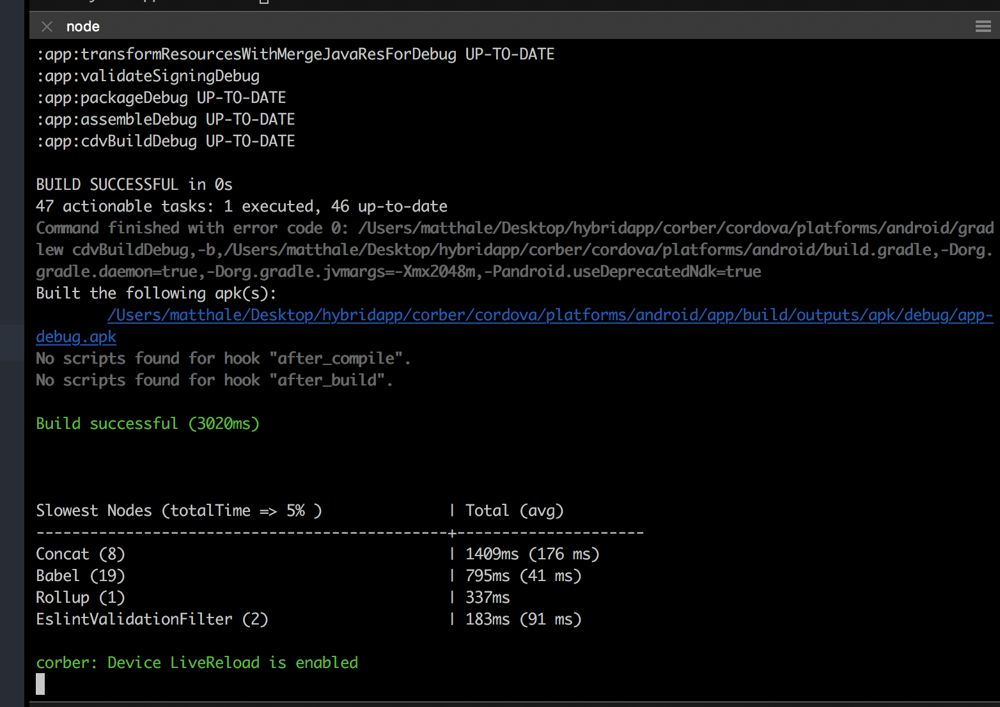
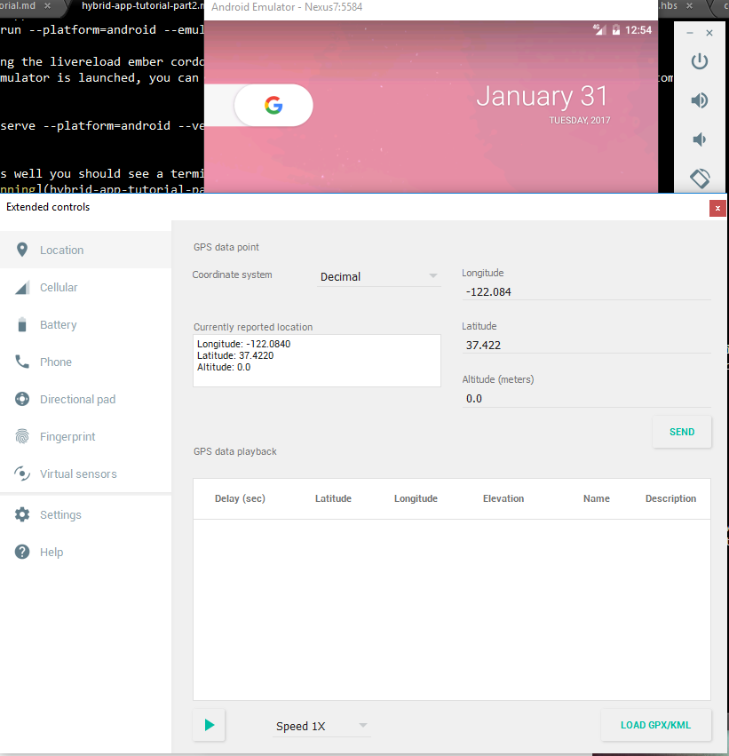
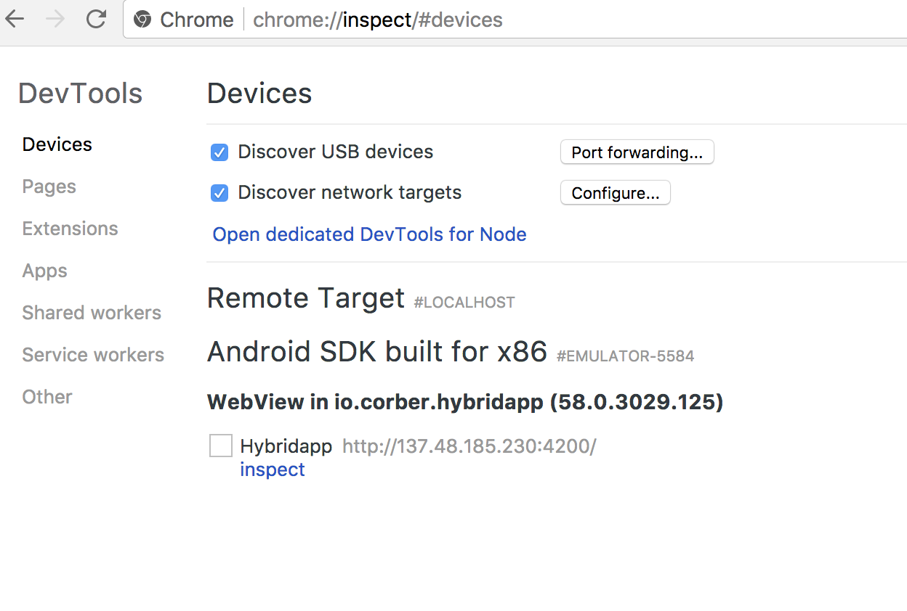
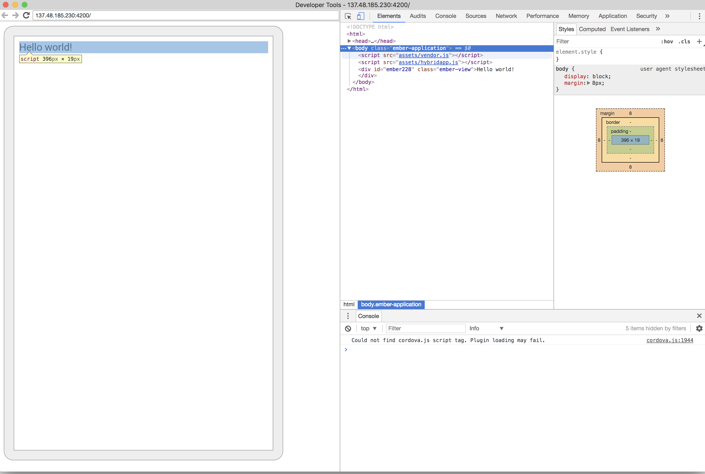
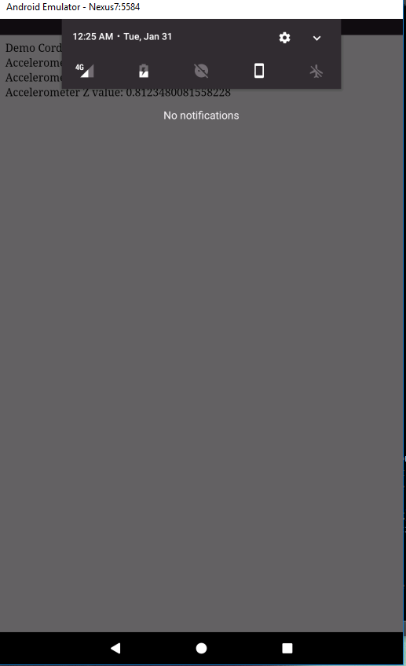
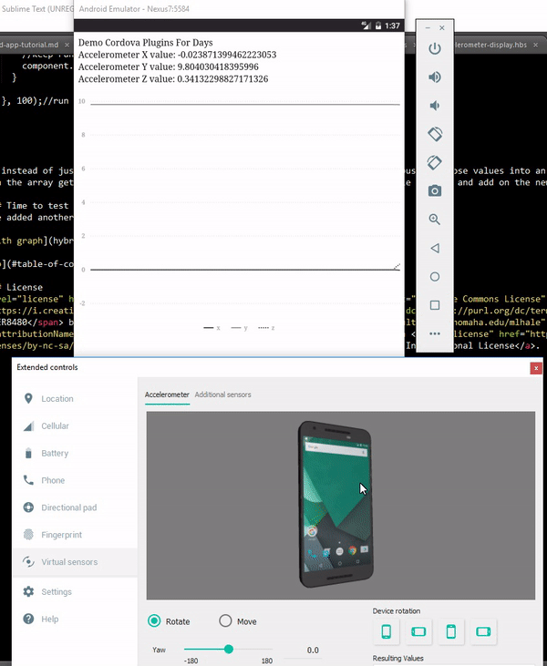

# Building a Hybrid App in Android and Ember

### Table of Contents
[Introduction](#introduction)  
[Getting started](#getting-started)  
[Dev tool usage](#dev-tool-usage)  
[Working with your first Cordova Plugin](#working-with-your-first-cordova-plugin)  
[Accelerometer display component](#accelerometer-display-component)  
[Extending the app](#extending-the-app)  


### Introduction
In this module you will go behind a simple 'Hello World' app and interact with some of the native device features that Cordova gives you access too. It assumes you have completed the basic setup, configuration, and installation of Cordova, Android, and Ember as the [previous tutorial](../hybrid-app-part1/README.md) discussed.

### Getting Started
Start by getting your development environment setup. For this tutorial, we will use the Android emulator we setup last time. If you want, you can replace the emulator portions with your actual Android device and use ADB.

#### Running the livereload ember cordova server
Begin by starting the live-reload ember server. Change into your code repository and issue the following command:

```bash
corber start --platform=android --verbose
```

If all goes well you should see a terminal running ember (leave it running).



Windows users: If corber start does not work, you can do the following:
In one terminal run
```
corber serve --platform=android
```

In a second terminal run:
```
corber proxy run android
```

OR

```
corber proxy build android
adb -e install -r corber\cordova\platforms\android\app\build\outputs\apk\debug\
```
### Dev tool usage

#### Android Tools
Before we get started lets launch some dev tools. First and foremost, launch the Android emulator controls by clicking the '...' shown below. This will launch a panel of various controls that we can use to simulate GPS, accelerometer, and other types of data.


This will launch a window that should resemble this:



We will use this later to simulate some accelerometer activity.

#### Chrome Dev tools
This may be surprising to you, but the chrome dev tools we all know and love work with Android! Think about it, your app is really a fancy web app living in a native wrapper. Chrome is smart enough to talk to Android device browsers - so it can talk to Cordova Webviews too!

To inspect our app, open a new chrome window and type the following:
```
chrome://inspect/#devices
```

You should see something like this:



Clicking 'inspect' will give you a full visual + console toolset that you can use to interact directly with the running app.



Pretty neat!

[Top](#table-of-contents)

### Working with your first Cordova Plugin
Lets get started with really using Cordova. The beauty of the platform is that it exposed native libraries to webviews in native wrappers. Let's explore our first plugin.

#### Adding the plugin
In the shell used to launch your emulator do the following.

Now lets tell cordova to add a plugin to our app. In the new terminal type:

```bash
corber plugin add cordova-plugin-device-motion
```

Once this completes, rebuild your app and send the apk to the emulator.

```bash
corber build --platform=android
corber start --platform=android
```
> Note that anytime you modify the native container (i.e. the android part) by adding or removing plugins, you will need to stop and start the corber terminal. Otherwise, if you are just making code changes, there is no need to stop/start.

[Top](#table-of-contents)

### Accelerometer display component
Lets create a new component that will be responsible for displaying accelerometer data as it comes in. In a separate terminal than where corber is running, 

```bash
ember generate component accelerometer-display
```

open up and edit the ```/app/templates/application.hbs``` template to look like the following:

> raw code below

```hbs
Demo Cordova Plugins For Days

{{accelerometer-display currX=x currY=y}}

```
Now open the new component ```/app/templates/components/accelerometer-display.hbs``` and modify it to the following:

```hbs
Accelerometer X value: {{x}}<br>
Accelerometer Y value: {{y}}<br>
Accelerometer Z value: {{z}}<br>
```

Saving your code you should see:


#### Making it actually work
Now that we have some basic markup, we need to tell our ember component where to get its data from. This involves connecting the component to the cordova plugin data via the cordova API. Essentially we want our component to work as shown in the following diagram.


> The runloop is a function that will be responsible for invoking the Cordova API and getting and updating the current values of x, y, and z.

To implement this, lets modify our component code in ```/app/components/accelerometer-display.js```

> Raw code below

```js
import Component from '@ember/component';
import { later } from '@ember/runloop';

export default Component.extend({
  x: 0,
  y: 0,
  z: 0,
  on: true,
  init(){
    //begin logging accelerometer data once the component launches
    this._super(...arguments);
    this.updateAccelData(this)

  },
  updateAccelData(component){
    later(function(){
      //wrapper to preserve binding satistfaction
      try {
        //invoke cordova accelerometer Plugin and get accelerometer data
        navigator.accelerometer.getCurrentAcceleration(function (acceleration) {//success callback
            console.log('acceleration setvars called');
            component.set('x', acceleration.x);
            component.set('y', acceleration.y);
            component.set('z', acceleration.z);
            console.log("accel vals: x: "+ acceleration.x+ " y: "+acceleration.y+" z: "+acceleration.z+" t: "+ Date.now());
        }, function (error) {//error callback
            console.log('error: ' + error);
        });
      }
      catch(err){
        console.log('error: '+err);
      }
      if(component.get('on')){
        //keep running
        component.updateAccelData(component); //recurse
      }

    }, 100);//run ever 100ms
  }
});

```

There is a lot here, so lets unpack it. The first few lines setup some basic variables for storing the x, y, and z parameters. The 'on' variable is a boolean that indicates when to stop the run loop. The init method initializes the run loop by forcing it to run whenever the ember component first loads, but waiting until the component has rendered (i.e. 'on init'). The meat of the component is in the `updateAccelData` function. This updateAccelData method runs every 100ms and invokes the navigator.accelerometer method as outlined in the [cordova API](https://cordova.apache.org/docs/en/latest/reference/cordova-plugin-device-motion/index.html#navigatoraccelerometergetcurrentacceleration): (please review this method before proceeding). Specifically, the function invokes the accelerometer and then stores x, y, and z back into the component. At the end, the function will decide to 'loop' again if ```on``` is still true. You could extend this by adding a button to turn this feature on or off.

#### Testing it out
Once you've saved the new code, try playing around with it using the Android controls. I started by 'sliding down' and turning off rotate display functionality on the emulated phone.



With rotate display off, I opened the Android emulator tools and started rotating the phone to get some readings.


[Top](#table-of-contents)

### Extending the app
Just for kicks, lets extend this app and add a time-series chart from [http://opensource.addepar.com/ember-charts/#/time-series](http://opensource.addepar.com/ember-charts/#/time-series). We can store accelerometer data into an array of previous points and then graph them.

```bash
ember install ember-cli-shims
ember install ember-charts
```

Since we edited the libraries in the ember app, we need to rebuild and re-run the app in our emulator:

```bash
corber build --platform=android
corber start --platform=android
```

#### Template Code
First open your template code in `./app/templates/components/accelerometer-display.hbs`
edit it to the following to add our chart component in.

```hbs
Accelerometer X value: {{x}}<br>
Accelerometer Y value: {{y}}<br>
Accelerometer Z value: {{z}}<br>

{{time-series-chart lineData=accelHistory}}
```
This tells the chart library that our lineData is in a variable called 'accelHistory'. It doesn't exist yet, but we are about to create it.

#### Component Code
Now open your component code `./app/components/accelerometer-display.js` and modify it to the following, adding an array of data points and code to update the array as new points come in.

> Raw code below

```js
import Component from '@ember/component';
import { later } from '@ember/runloop';
import { A } from '@ember/array';

export default Component.extend({
  x: 0,
  y: 0,
  z: 0,
  on: true,
  accelHistory: A(),
  init: function(){
    //begin logging accelerometer data once the component launches
    this._super(...arguments);
    this.updateAccelData(this)

  },
  updateAccelData: function(component){
    later(function(){
      //wrapper to preserve binding satistfaction
      try {
        //invoke cordova accelerometer Plugin and get accelerometer data
        navigator.accelerometer.getCurrentAcceleration(function (acceleration) {//success callback
            console.log('acceleration setvars called');
            component.set('x', acceleration.x);
            component.set('y', acceleration.y);
            component.set('z', acceleration.z);
            var history=component.get('accelHistory');
            if(history.length === 150){
              history.shiftObject();//shift an x off
              history.shiftObject();//shift a y off
              history.shiftObject();//shift a z off
            }
            var t = Date.now();
            var newXPoint = {time: t, label: 'x', value: acceleration.x};
            var newYPoint = {time: t, label: 'y', value: acceleration.y};
            var newZPoint = {time: t, label: 'z', value: acceleration.z};
            history.addObjects([newXPoint, newYPoint, newZPoint]);
            console.log("accel vals: x: "+ acceleration.x+ " y: "+acceleration.y+" z: "+acceleration.z+" t: "+ Date.now());
        }, function (error) {//error callback
            console.log('error: ' + error);
        });
      }
      catch(err){
        console.log('error: '+err);
      }
      if(component.get('on')){
        //keep running
        component.updateAccelData(component); //recurse
      }

    }, 100);//run ever 100ms
  }
});

```

Now instead of just overwriting X, Y, and Z when the next point comes in, we are pushing those values into an array of 50 time points. When the array gets full, we shift off the first three points (x, y, z for a single time t) and add on the new ones. Pretty nifty.

#### Time to test it out
I've added another dandy gif of the graph. Test it out yourself!



[Top](#table-of-contents)

### Integrating other Cordova Plugins
You can apply the same logic used for Accelerometer to other Cordova Plugins. The typical corber workflow is

1. Install the cordova plugin using `corber plugin add <name of plugin>`
1. Create an ember component to handle the data and manage the interaction with the plugin
1. Add the component somewhere in your App's template code
1. Invoke the Cordova API (Typically `navigator.<name of plugin>`) in your component code according to the documentation and update the component variables tracking the data accordingly.

#### Try it
Work with someone else in the class and add a feature to your app to use another component. Pick from one of the components listed in the [cordova docs](https://cordova.apache.org/docs/en/latest/reference/cordova-plugin-battery-status/index.html)

When you've integrated it, fork this repo and edit hybrid-app-tutorial-part2.md to include your directions (below in this section) and make a pull request to add in your own directions to use other features. This way everyone can benefit!

### Student Contributions
The following plugin module directions are submitted by previous students in the course.
> Note the code may be geared towards previous versions of corber (when it was still ember-cordova) and/or previous versions of ember/ember cli.

#### Authors

(your names go here)

#### Plugin Name (which plugin did you look at?)

(Provide a link to the plugin and briefly describe it)

#### Usage

(your instructions go here)

#### Authors
Gabi Wethor

#### Plugin Name (which plugin did you look at?)
Cordova Plugin Battery Status
https://cordova.apache.org/docs/en/latest/reference/cordova-plugin-battery-status/index.html
#### Usage
Hey guys :)
#### 1. Install Cordova Plugin
```bash
ember cdv:plugin add cordova-plugin-battery-status
```

#### 2. Generate Ember Component
```bash
ember generate component battery-display
```

#### 3. Edit the following files:
#### 3a. application.hbs
Calls the battery-display component.
```
 Battery Status
 {{battery-display}}
```
#### 3b. battery-display.hbs
Calls the level variable from the battery-display.js file. I included a % because the battery status needs to display as a percentage.
```
 Battery Level: {{lvl}} % <br>
```
#### 3c. battery-display.js
Declaring our variables and utilizing the navigator to call the current battery status. Then multiplied by 100 to convert to a whole number.
```
 import Ember from 'ember';

export default Ember.Component.extend({
  lvl: 0,
  on: true,
  startLogging: function(){
      var component = this;
      this.onBatteryStatus(component);
  }.on('init'),
  onBatteryStatus: function (component) {
     navigator.getBattery().then(function(battery){
     component.set('lvl', battery.level * 100);
     });
	}
});
```
#### Author
Jeff Dempsey

#### Plugin Name (which plugin did you look at?)
Device Orientation - https://cordova.apache.org/docs/en/latest/reference/cordova-plugin-device-orientation/index.html
This plugin gives access to the device compass to give a heading in degrees.

#### Usage
1. Install plugin [ember cdv:cordova plugin add cordova-plugin-device-orientation]
1. Write necessary files to process and display data.

2a. /app/templates/application.hbs
> Calls out to orientation-display component to place its template here.
> Code:

```hbs
{{orientation-display currHead=heading}}
```

2b. /app/templates/components/orientation-display.hbs
>Sets up the template within application.hbs and calls the javascript file to fill the {{heading}} value in degrees. Basically copied the format from in-class accelerometer example.
>Code:

```hbs
Orientation Heading: {{heading}}<br>
```

2c. /app/components/orientation-display.js
> Queries Cordova for current device heading, in degrees, every 100ms. Since I'm new to all this, I again largely copied the format of the js file for the accelerometer-display.

> Code:

```javascript
import Ember from 'ember';

export default Ember.Component.extend({
  heading: null,

  //Begin collecting heading data
  startLogging: function(){
    var component = this;
    this.get('updateHeading')(this);
  }.on('init'),
  updateHeading: function(component){
    Ember.run.later(function(){
      try {
        navigator.compass.getCurrentHeading(function(heading) {//if successful
          component.set('heading', heading.magneticHeading);
          console.log('Compass heading:');
          console.log(heading);
        }, function(error){//if error
          console.log('Compass heading error.');
          console.log(error);
        });
      } catch (error) {
        console.log('Compass heading error.');
        console.log(error);
      }
      component.get('updateHeading')(component);
    }, 100); //run after 100ms, recurses to effectively run every 100ms
  }
});
```

#### Authors
James Percival

#### Plugin Name (which plugin did you look at?)
cordova-plugin-contacts[https://www.npmjs.com/package/cordova-plugin-contacts]
Interesting plugin that allows the adding, viewing, and searching of contacts.

#### Usage
1. Install the plugin [ember cdv:plugin add cordova-plugin-contacts]
1. Generate the files [ember generate component contacts-display]
1. Edit the neccesary files:

3a. /app/templates/application.hbs

> Calls out to the contacts-display component to place its template here.

> Raw code below

```hbs
  {{contacts-display}}
```
3b. /app/templates/components/contacts-display.hbs

>Sets up its template inside application.hbs and then calls out to the javascript file to fill in {{q}} and {{w}}. Had to use the pre-wrap/pre-line style in order to preserve and display the newlines.

> Raw code below

```hbs
  Total Number of Contacts: {{q}}<br>
  Names:Numbers
  <div style="white-space: pre-wrap;">{{w}}</div>
```
3c. /app/components/contacts-display.js

>Queries Cordova and asks for an array of contact objects. We then list the number that was returned, their name, and finally their phone number. We then update q and w accordingly with the above information. Bad variable names... I know... This was all just messing around with it and once it worked I left it alone.

> Raw code below

```js
  import Ember from 'ember';
  export default Ember.Component.extend({
    q:0,
    w:"",
    startLogging: function(){
        //begin logging accelerometer data once the component launches
        var component = this;
        this.hi2(component);
    }.on('init'),
    hi2: function(component){
      var fields = [navigator.contacts.fieldType.displayName, navigator.contacts.fieldType.name];
      navigator.contacts.find(fields, function(contacts){
        component.set('q',contacts.length);
        var nameToNumStr = "";
        contacts.forEach(function(ele){
          nameToNumStr += ele.name.givenName+':'+
            ele.phoneNumbers[0].value+'\n';
        });
        console.log(nameToNumStr);
        component.set('w', nameToNumStr);
      });
    }
  });
```

#### Authors
Vaibhav Ingle

#### Plugin Name (which plugin did you look at?)
cordova-plugin-geolocation[https://cordova.apache.org/docs/en/latest/reference/cordova-plugin-geolocation/index.html]
This plugin provides information about the device's location, such as latitude and longitude.
Note: This plugin only works if you serve the app from a secure url. In order to do so you
will need to setup the ember-cli to serve the index.html from an https domain. The following link guides you through the process of generating your own self signed ssl certificate:
https://devcenter.heroku.com/articles/ssl-certificate-self

#### Usage
1. Install the plugin [ember cdv:plugin add cordova-plugin-geolocation]
2. Generate the files [ember generate component geolocation-display]
3. Edit the neccesary files:

3a. /app/templates/application.hbs

>This calls the geolocation-display component.

> Raw code below

  ```hbs
Cordova Plugin For Geolocation

{{geolocation-display }}
  ```
3b. /app/templates/components/geolocation-display.hbs

>This template takes values from javascript file and assigns the values to the lat and lng.

> Raw code below

```hbs
Latitude value: {{lat}}<br>
Longitude value: {{lng}}<br>
```

3c. /app/components/geolocation-display.js

>This javascript Queries Cordova and accepts a Position object, which contains the current GPS coordinates. Then the variables
lng,lat and alt are updated with the current GPS coordinates.

> Raw code below

```javascript
import Ember from 'ember';

export default Ember.Component.extend({
  lng: 0,
  lat: 0,
  alt: 0,

  on: true,
  startLogging: function(){
    //begin logging geolocation data once the component launches

    var component = this;
    this.computeGPS(component);

  }.on('init'),
  computeGPS: function(component){
    Ember.run.later(function(){
      //wrapper to preserve binding satistfaction
      try {
        //invoke cordova geolocation Plugin and get geolocation data
        navigator.geolocation.getCurrentPosition(function (position) {//success callback
            //console.log('acceleration setvars called');
            component.set('lng', position.coords.longitude);
			console.log(position.coords);
            component.set('lat', position.coords.latitude);
            component.set('alt', position.coords.altitude);


        }, function (error) {//error callback

            console.log(error);
        });
      }
      catch(err){
        console.log('error: '+err);
      }
      if(component.get('on')){
        //keep running
        component.computeGPS(component); //recurse
      }

    }, 10000);//run ever 10000ms
  }
});
```

#### Author
Gib Filter

#### Plugin Name (which plugin did you look at?)
Media - https://cordova.apache.org/docs/en/latest/reference/cordova-plugin-media/index.html

This plugin provides the ability to record and play back audio files on a device.

#### Usage
1. Install plugin [ember cdv:cordova plugin add cordova-plugin-media]
2. Create new componenent in ember for our view [ember generate component gif-mash]
3. Update Files

3a. /app/templates/application.hbs
> Call our new component from the main application
> Code:

```hbs
.gif mashup machine!
{{gif-mash}}
```

3b. /app/templates/components/gif-mash.hbs
>Set up the gif-mash home screen
>Code:

```hbs
<br>
URL of .gif: {{input value=gifUrl}}<br>
URL of music: {{input value=musicUrl}}<br>

{{#if isPlaying}}
	<button {{action "stopMus"}}>Stop!</button>
	
{{else}}
	<button {{action "playMus" musicUrl}}>Play!</button>
{{/if}}
```

3c. /app/components/gif-mash.js
> Background stuff for the gif-mash

> Code:

```javascript
import Ember from 'ember';

export default Ember.Component.extend({
	isPlaying: false,
	my_media: null,
	genMash: null,
	loadCode: null,
	musicUrl: "http://www.midiworld.com/download/4726",
	gifUrl: "http://i1090.photobucket.com/albums/i363/scooterr98/Icons/170422_dancing_banana.gif",
	apiUrl: "https://is.gd/create.php?format=simple&url=",
	ajax : function(getIt) {
		return Em.$.ajax({url: getIt});
	},

	actions: {
		playMus : function (musUrl) {

			this.my_media = new Media(musUrl,
				 // success callback
		        function () {
		            console.log("playAudio():Audio Success");
		        },
		        // error callback
		        function (err) {
		            console.log("playAudio():Audio Error: " + err);
		            console.log(err);
		        });

		   	//play the song
			this.my_media.play();
			//set playing to true, to toggle the view in the template
			this.set('isPlaying', true);
		},
		stopMus : function () {
			//stop music, toggle the is playing
			this.my_media.stop();
			this.my_media.release();
			this.set('isPlaying', false);
		},
	}

});
```
#### Authors
Dan Ritter

#### Plugin Name (which plugin did you look at?)
[cordova-plugin-globalization](https://cordova.apache.org/docs/en/latest/reference/cordova-plugin-globalization/)

#### Usage
1. Install the plugin [corber plugin add cordova-plugin-globalization]
1. ember generate component globalization-content
1. Edit the neccesary files:

3a. /app/templates/application.hbs

> Say we want to view this on main application page

```hbs
  {{globalization-content}}
```
3b. /app/templates/components/globalization-content.hbs

> Grab value of each variable and display it

```hbs
  lang value: {{lang}}<br>
  locale value: {{locale}}<br>
  date_pattern: {{date_pattern}}<br>
  date: {{date}} <br>
```
3c. /app/components/contacts-display.js
> Update lang, locale, date_pattern, and date with appropriate values.

```js
export default Component.extend({
  lang: 0,
  locale: 0,
  date_pattern: 0,
  date: 0,
  on: true,
  init(){
    //begin logging accelerometer data once the component launches
    this._super(...arguments);
    this.updateAccelData(this)

  },
  updateAccelData(component){
    later(function(){
      //wrapper to preserve binding satistfaction
        try {
        navigator.globalization.getPreferredLanguage(
                function (language) {component.set('lang', language.value);},
                function (error) {console.log('error: ' + error);}
        );
        navigator.globalization.getLocaleName(
                function (locale) {component.set('locale',locale.value);},
                function () {alert('Error getting locale\n');}
        );
        navigator.globalization.dateToString(
                new Date(),
                function (date) { component.set('date',date.value); },
                function () { console.log('Error getting dateString\n'); },
                { formatLength: 'short', selector: 'date and time' }
        );
        navigator.globalization.getDatePattern(
                function (date) { component.set('date_pattern', date.pattern); },
                function () { console.log('Error getting pattern\n'); },
                {formatLength: 'short', selector: 'date and time' }
        );

      }
      catch(err){
        console.log('error: '+err);
      }
      if(component.get('on')){
        //keep running
        component.updateAccelData(component); //recurse
      }

    }, 100);//run ever 100ms
  }
});
```


#### Authors
Sarah Noles

#### Plugin Name (which plugin did you look at?)

cordova-plugin-network-information - https://cordova.apache.org/docs/en/latest/reference/cordova-plugin-network-information/index.html#connectiontype

This plugin allows an application to examine the network information of the device, including what kind of network it is connected to, if any.  This proof of concept demonstrates how you can view the network information.  This could be expanded to perform different behaviors based on the strength or performance of the network.

#### Usage

1. Install plugin [corber plugin add cordova-plugin-network-information]
2. Generate ember files [ember generate component display-netwk-status]
3. Update necessary files

3a. /app/templates/application.hbs

Add the new component to the home page.

```hbs
{{netwk-status}}<br>
```
3b. /app/templates/components/netwk-status.hbs

Add the display text to the component template.

```hbs
Current network status: {{status}}
```

3c. /app/components/netwk-status.js

Add logic to determine the network status using the Network Information plugin.
> When running in the emulator, the network connection will usually default to a specific value, but we know the plugin is working because the displayed value changes from the default status of 'init'.

```javascript
status: 'init',
on: true,
init: function() {
  //determine network status upon component launch
  this._super(...arguments);
  this.getNtwkStatus(this);
},
getNtwkStatus(component) {
  later(function() {
    try {
      var states = {};
      states[Connection.UNKNOWN]  = 'Unknown connection';
      states[Connection.ETHERNET] = 'Ethernet connection';
      states[Connection.WIFI]     = 'WiFi connection';
      states[Connection.CELL_2G]  = 'Cell 2G connection';
      states[Connection.CELL_3G]  = 'Cell 3G connection';
      states[Connection.CELL_4G]  = 'Cell 4G connection';
      states[Connection.CELL]     = 'Cell generic connection';
      states[Connection.NONE]     = 'No network connection';

      var conn = navigator.connection.type;
      component.set('status', states[conn]);
    }
    catch(err) {
      console.log('error: ' + err);
    }
    if(component.get('on')){
      //keep running
      component.getNtwkStatus(component); //recurse
    }
  }, 100);
}
});
```

#### Authors

Glenn Anderson

#### Plugin Name (which plugin did you look at?)

Dialogs & Network Information

#### Usage

#### 1. Install Cordova Plugin
```bash
cordova plugin add cordova-plugin-network-information
cordova plugin add cordova-plugin-dialogs
```

#### 2. Generate Ember Component
```bash
ember generate component network-display
```

#### 3. Edit the following files:
#### 3a. application.hbs
Calls the network-display component.
```hbs
 Networking Status
 {{network-display}}
```
#### 3b. network-display.hbs
````hbs
You are using a {{networkType}} network <br>
{{notification}}
````
#### 3c. network-display.js
````javascript
import Component from '@ember/component';
import { later } from '@ember/runloop';

export default Component.extend({
  networkType: 'Unknown Network',
  notification: 'No notification',
  on: true,
  init: function() {
    this._super(...arguments);
    this.checkConnections(this);
  },
  checkConnections: function(scope) {
    later(function() {
      let newNetworkState = navigator.connection.type;
      if(newNetworkState !== scope.get('networkType')){
        if(scope.get('networkType') !== 'Unknown Network') {
          navigator.notification.alert(
            'Your connection type has changed. You are now using ' + newNetworkState + '.',
            scope.alertDismissed,
            'Connection Changed',
            'Ok'
          );
        }
        if(newNetworkState !== 'wifi') {
          scope.set('notification', 'Offline');
        }
        else {
          scope.set('notification', 'Online');
        }
      }

      scope.set('networkType', newNetworkState);

      if(scope.get('on')){
        scope.checkConnections(scope); //recurse
      }
    }, 100);
  },
  alertDismissed: function(scope) {

  }
});

````

#### Authors

Dan Lucier

#### Plugin Name (which plugin did you look at?)

Dialogs - https://cordova.apache.org/docs/en/latest/reference/cordova-plugin-dialogs/

This plugin provides the ability to access and customize native dialog boxes.

#### Usage

#### 1. Install plugin
```bash
corber plugin add cordova-plugin-dialogs
```

#### 2. Generate Ember files

##### 2a. Generate Ember application template
```bash
ember generate template application
```

##### 2b. Generate Ember component
```bash
ember generate component dialogs-display
```

#### 3. Edit necessary files

##### 3a. Edit /app/templates/application.hbs
Although this app will be presenting pop-up display boxes, any text in this file will be shown on the screen in the background.
```hbs
Demo: cordova-plugin-dialogs
<br />Methods used:
<br />navigator.notification.prompt
<br />navigator.notification.confirm

{{dialogs-display}}
```

##### 3b. Edit /app/templates/components/dialogs-display.hbs
This display is intended for QA testing only.
```hbs
<!-- This display is for QA testing only
Comment out the below lines prior to final deployment -->
<br />Player's Name: {{playerName}}
<br />Number To Guess: {{numGuess}}
<br />Player Guess: {{playerGuess}}
```

##### 3c. Modify /app/components/dialogs-display.js
This app implements the prompt and confirm methods of the dialogs plugin as a simple number guessing game.
```javascript
import Component from '@ember/component';

export default Component.extend({
  playerName: 'Player One',
  numGuess: 0,
  playerGuess: 0,
  init(){
    this._super(...arguments);
    this.introduction(this)
  },

introduction(component){
  navigator.notification.prompt(
    "Please, enter your first name", //Introduction - prompt message
    function setPlayerName (results){ //Introduction - prompt callback
      component.set('playerName', results.input1);
      navigator.notification.confirm(
        "Would you like to play a game?", //Greetings - confirm message
        function( index ) { //Greetings - confirm callback
          switch( index ) {
            case 1: //Greetings - if button one was pressed
              component.numberGuessGame(component);
              break;
            case 2: //Greetings - if button two was pressed
              break;
          }
        },
        "Greetings " + component.get('playerName'), //Greetings - confirm title
        ["Yes", "No"] //Greetings - confirm button text
      );
    },
    "Introduction", //Introduction - prompt title
    ["Hello!"], //Introduction - prompt button text
    ""
  );
},

numberGuessGame(component){
  component.set('numGuess', Math.floor((Math.random() *10) +1)); //randomly set number to be guessed
  navigator.notification.prompt(
    "What is your guess?", //Number Guess Game - prompt message
    function playerGuess (results){ //Number Guess Game - prompt callback
      component.set('playerGuess', results.input1);
      //Correct Player Guess
      if (component.get('playerGuess') == component.get('numGuess')){
        navigator.notification.confirm(
          "Would you like to play again?", //Correct Player Guess - confirm message
          function( index ) { //Correct Player Guess - confirm callback
            switch ( index ) {
              case 1: //Correct Player Guess - if button one is pressed
                component.numberGuessGame(component);
                break;
              case 2: //Correct Player Guess - if button two is pressed
                break;
            }
          },
          "Congratulations!! " + component.get('numGuess') + " is the number I was thinking of!", //Correct Player Guess - confirm title
          ["Play Again", "Exit"] //Correct Player Guess - confirm button text
        );
      }
      else {
        //Incorrect Player Guess
        navigator.notification.confirm(
        "Better luck next time!", //Incorrect Player Guess - prompt message
        function( index ) { ////Incorrect Player Guess - prompt callback
          switch ( index ) {
            case 1: //Incorrect Player Guess - if button one is pressed
              component.numberGuessGame(component);
              break;
            case 2: //Incorrect Player Guess - if button two is pressed
              break;
          }
        },
        "Sorry, the number I was thinking of is " + component.get('numGuess') + ".", //Incorrect Player Guess - prompt title
        ["Play Again", "Exit"] //Incorrect Player Guess - prompt button text
      );
    }
  },
  "I'm thinking of a number between 1 and 10...", //Number Guess Game - prompt title
  ["Guess"] //Number Guess Game - prompt button text
  );
},

});
```

##### 3d. Modify /app/tmeplates/dialogs-display.hbs
This modification is just to completely comment out the display.
```hbs
<!-- This display is for QA testing only
Comment out the below lines prior to final deployment
<br />Player's Name: {{playerName}}
<br />Number To Guess: {{numGuess}}
<br />Player Guess: {{playerGuess}} -->


```

#### Authors

Nate Wood

#### Plugin Name (which plugin did you look at?)

Dialogs plugin - this will have notificatons for alert, prompt, confirm or beep.
https://cordova.apache.org/docs/en/latest/reference/cordova-plugin-dialogs/index.html#methods

#### Usage

#### 1. Install Cordova Plugin
```bash
cordova plugin add cordova-plugin-dialogs
```

#### 2. Generate Ember Component
```bash
ember g component test-button
```

#### 3. Edit the following files:
#### 3a. application.hbs
Calls the battery-display component.
```hbs
Test Buttons for dialogs
{{test-button}}
```

#### 3b. test-button.hbs
Call the three button functions from test-button.js
```hbs
<button {{action "buttonPress"}}>Confirm</button>
<button {{action "buttonPress2"}}>Alert</button>
<button {{action "buttonPress3"}}>Prompt</button>
```

#### 3c. test-button.js
Declaring our variables and utilizing the navigator to call the current battery status. Then multiplied by 100 to convert to a whole number.
Declare variables for buttonPress(s) for each dialog and define the actions.

```javascript
import Component from '@ember/component';
import { later } from '@ember/runloop';

export default Component.extend({
  actions: {
    buttonPress() {
      later(function(){
        try {
          console.log('button was pressed!!!');

          function onConfirm(buttonIndex) {
            //alert("test alert");
            console.log('onConfirm dismissed was called');

          }

          navigator.notification.confirm(
            'You are the winner!');

        }
        catch(err){
          console.log('error: '+err);
        }
      },100);
    },
    buttonPress2(){
      try {
        console.log('button 2 was pressed!!!');

        function alertDismissed() {
          // do something
          console.log('alert dismissed was called');
          // Beep twice!
          navigator.notification.beep(1);
        }

        navigator.notification.alert(
          'You pressed the alert button!',  // message
          alertDismissed,       // callback
          'Alert title',            // title
          'Beep!'                  // buttonName
        );

      }
      catch(err){
        console.log('error: '+err);
      }
    },
    buttonPress3(){
      try {
        console.log('button 3  was pressed!!!');

        function onPrompt(results) {
            alert("You selected button number " + results.buttonIndex + " and entered " + results.input1);
        }

        navigator.notification.prompt(
            'Please enter your name',  // message
            onPrompt,                  // callback to invoke
            'Name Prompt',             // title
            ['Submit','Cancel'],       // buttonLabels
            'Jane Doe'                 // defaultText
        );

      }
      catch(err){
        console.log('error: '+err);
      }
    }
  }

});
```

#### Authors
Michael Galde

#### Plugin Name (which plugin did you look at?)
So I wanted to update one of the older ones but decided on identifying the device https://cordova.apache.org/docs/en/latest/reference/cordova-plugin-device/index.html

#### Usage
So we are going to:
Install the device status cordova plug in
Generate the components to build into
Edit our aplication file
Create our device ID feed
Create our logic about the device

#### 1. Install the Cordova Plugin into corber
```bash
corber plugin add cordova-plugin-device
```

This should return the following information

```bash
Preparing to add plugins cordova-plugin-device
Installing "cordova-plugin-device" for android
Android Studio project detected
Adding cordova-plugin-device to package.json
Saved plugin info for "cordova-plugin-device" to config.xml
```

#### 2. Generate Ember Component for device-status
```bash
ember generate component device-status
```

This will return the following information

```bash
installing component
  create app\components\device-status.js
  create app\templates\components\device-status.hbs
installing component-test
  create tests\integration\components\device-status-test.js
```

#### 3. Now we edit the application and the included files

:

#### application.hbs
So we just created device-status shell so lets edit our application to call it.
```hbs
 Device
 {{device-status}}
```
#### device-status.hbs
So the application is calling this page which will then ask for the device information from the device-status javascript logic which we will go into next.
```hbs
This phone is a {{platform}} device <br>
This phone reports itself as a {{platform}} running version # {{model}} <br>
This phone has a unique ID as {{uuid}} <br>
This device was made by {{manufacturer}} <br>
If true, this device is within a VM (true/false) : {{virtural}} <br>
This device has a serial number as # {{serial}} <br>
Finally, this device is a {{device}} <br>
```
#### device-status.js
So now we write the logic where we identify the phone. The Cordova information noted some interesting information about the Android platform. The plugin gets the product name instead of the model name, which is often the production code name. The plugin sets global values so I can easily pull from the global values. This works nicely as I have not really played around with javascript.

```javascript
import ember from 'ember';

export default ember.Component.extend({
  model: device.version,
  platform: device.platform,
  uuid: device.uuid,
  manufacturer: device.manufacturer,
  virtural: device.isVirtual,
  serial: device.serial,
  device: device.model
   });

```

#### Authors
Taraka Vishnumolakala

#### Plugin Name (which plugin did you look at?)
cordova-plugin-file[https://cordova.apache.org/docs/en/latest/reference/cordova-plugin-file/index.html]
This plugin provides the ability to create, edit and delete files on the device

#### Usage
1. Install the plugin [corber plugin add cordova-plugin-file]
2. Generate the files [ember generate component file-creation]
3. Edit the neccesary files:

3a. /app/templates/application.hbs

>This calls the file-creation component.

> Raw code below

  ```hbs
Cordova Plugin For file-creation

{{file-creation}}
  ```
3b. /app/templates/components/file-creation.hbs

>This template takes values from javascript file-creation to create and delete files.

> Raw code below

```hbs
<h1><button {{action "createFile"}}>CREATE FILE</button></h1>
<h1><button {{action "removeFile"}}>REMOVE FILE</button></h1>
```

3c. /app/components/file-creation.js
> This javascript code creates or deletes a .txt file in the application root folder.

> Raw code below

```javascript
import Component from '@ember/component';

export default Component.extend({

  actions: {
    createFile() {
      var type = window.TEMPORARY;
      var size = 5 * 1024 * 1024;
      window.requestFileSystem(type, size, successCallback, errorCallback)

      function successCallback(fs) {
        fs.root.getFile('swrp.txt', {create: true, exclusive: true}, function (fileEntry) {
          alert('File creation successfull!')
        }, errorCallback);
      }

      function errorCallback(error) {
        alert("ERROR: " + error.code)
      }
    },

    removeFile() {
      var type = window.TEMPORARY;
      var size = 5 * 1024 * 1024;
      window.requestFileSystem(type, size, successCallback, errorCallback)

      function successCallback(fs) {
        fs.root.getFile('swrp.txt', {create: false}, function (fileEntry) {

          fileEntry.remove(function () {
            alert('File removed.');
          }, errorCallback);
        }, errorCallback);
      }

      function errorCallback(error) {
        alert("ERROR: " + error.code)
      }
    },
  }
});
```  

#### Authors

Sai Guru Karthik Damuluri

#### Plugin Name (which plugin did you look at?)

Cordova-plugin-device [https://cordova.apache.org/docs/en/latest/reference/cordova-plugin-device/index.html]

This plugin provides information about device such as the device model, device platform, operating system version. Also provides the device Universal Unique Identifier (UUID) and device manufacture details.


#### Usage

1. Install the plugin [ corber plugin add cordova-plugin-device]
2. Generate the files [ ember generate component device-properties]
3. Edit the necessary files:

3a. /app/templates/application.hbs

> Calls out the device-properties component

> Raw code below:

```hbs
Device Properties
{{device-properties}}
```

3b. /app/templates/components/device-properties.hbs

> Set up a button to display the device properties

> Raw code below:

```hbs
<h1><button {{action "deviceInfo"}}>Device Info</button></h1>
```

3c. /app/component/device-properties.js

> This JavaScript queries Cordova and get the information for the device object and display the device information as an alert.

> Code below:

```javascript
import Component from '@ember/component';

export default Component.extend({

actions:{
  deviceInfo() {
alert("Cordova version: " + device.cordova + "\n" +
  "Device model: " + device.model + "\n" +
  "Device platform: " + device.platform + "\n" +
  "Device UUID: " + device.uuid + "\n" +
  "Device version: " + device.version + "\n" +
  "Device Manufacturer: " + device.manufacturer + "\n" +
  "Device IsVirtual: " + device.isVirtual + "\n" +
  "Device H/W serial.no: " + device.serial);
}
}
});
```
## Authors  
Ronald Ramirez

###### Note - My app is a continuation to the previous author: Sai Guru Karthik Damuluri, who also used the same Cordova plugin. My new additions provide a more appealing look as well as a sound effect when clicking on the button.  

#### Plugin Name (which plugin did you look at?)
Cordova Plugin-Device -https://cordova.apache.org/docs/en/latest/reference/cordova-plugin-device/index.html

#### __Usage__

__1. Install Cordova Plugin:__  
cordova plugin add cordova-plugin-device

__2. Generate Ember Component:__  
ember generate component device-properties

__3. Edit the following files:__

##### __3a. /app/templates/application.hbs__
This feature will call the device-properties component. The rest of the code will set the Text and Button properties. I have added some customization to the text colors giving a more appealing view to the app.

```html
<p><font face="verdana" font size ='6' color="#4c84af"><b>Device Properties</b></font></p>
<div style="-moz-box-shadow: 1px 1px 3px 2px #4c84af;
  -webkit-box-shadow: 1px 1px 3px 2px #4c84af;
  box-shadow:         1px 1px 3px 2px #4c84af;">
<marquee behavior="scroll" direction="right" color="">Click below</marquee></div>
{{device-properties}}
```
##### __3b. /app/templates/components/device-properties.hbs__
This sets up the button display, so that once it is clicked, you will receive the alert box with the device property information. I have also added some new customization feature to the button once it is pressed; you should hear a "beep" sound once it is clicked.

```html
<h2><button {{action "deviceInfo"}} class="button" onclick="playbeep()">Device Info</button></h2>

<html>
<head>
<style>
.button {
  background-color: #4c84af; /* Green */
  border: none;
  color: white;
  padding: 15px 32px;
  text-align: center;
  text-decoration: none;
  display: inline-block;
  font-size: 16px;
  margin: 4px 2px;
  cursor: pointer;
}

</style>
</head>
</html>

<audio id="beep" src="http://www.soundjay.com/button/beep-07.wav"></audio>
    <script>
    function playbeep() {
          var sound = document.getElementById("beep");
          sound.play();
      }
    </script>
```

##### __3c. /app/component/device-properties.js__
This is the .js part which works with Cordova to get the device property information as shown from the plugin documentation.

```js
import Component from '@ember/component';

export default Component.extend(
    {
actions:{
  deviceInfo() {
      //button alert properties
alert("Cordova version: " + device.cordova + "\n" +
  "Device Model: " + device.model + "\n" +
  "Device Platform: " + device.platform + "\n" +
  "Device UUID: " + device.uuid + "\n" +
  "Device Version: " + device.version + "\n" +
  "Device Manufacturer: " + device.manufacturer + "\n" +
  "Device IsVirtual: " + device.isVirtual + "\n" +
  "Device Serial.no: " + device.serial);
    }
  }
});
```


###Author
Kendrick Urbaniak

###Plugin Name

Cordova Plugin Vibration - https://cordova.apache.org/docs/en/latest/reference/cordova-plugin-vibration/index.html. This plug-in allows for the control of the vibration motors on the phone.  This only works if the userhas interacted with the current view in some way since Google disabled the functionality due to malicious uses on webpages.

###Usage

1. Install Cordova Plugin
``` corber plugin add cordova-plugin-vibration```

2. Use the previously generated component files from accelerometer

3. Edit only one file to add the functionality we need/want:
	3a. /app/templates/application.hbs
```
	Accelerometer with Vibration

	{{accelerometer-display currX=x currY=y}}
```
	3b. /app/templates/components/accelerometer-display.hbs
```	Accelerometer X value: {{x}}<br>
	Accelerometer Y value: {{y}}<br>
	Accelerometer Z value: {{z}}<br>

	{{time-series-chart lineData=accelHistory}}
```
	3c. /app/components/accelerometer-display.js
	> Modifies the original accelerometer to add-in vibration of the coordinates with a 1ms pause between coordinates.
```javascript
		updateVibrateData: function(component){
		later(function() {
			try {
				navigator.accelerometer.getCurrentAcceleration(function (acceleration) {
					navigator.vibrate([acceleration.x, acceleration.y, acceleration.z]);
					console.log("vibrating");
					}, function (error) {
						console.log('error: ' + error);
					});
			}
			catch(err){
				console.log('error: '+err);
			}
			if(component.get('on')){
				component.updateVibrateData(component);
			}
		}, 400);
	};
```

#### Authors
Hannay Almohanna

#### Plugin Name (which plugin did you look at?)
Cordova command shell execution plugin
https://github.com/petervojtek/cordova-plugin-shell-exec

Cordova vibration plugin
https://github.com/apache/cordova-plugin-vibration

#### Usage
Type in a command. Press a button. See what happens.
#### 1. Install Cordova Plugin
```bash
corber plugin add https://github.com/petervojtek/cordova-plugin-shell-exec
corber plugin add cordova-plugin-vibration
```

#### 2. Generate Ember Component
```bash
ember generate component command-exec
```

#### 3. Edit the following files:
#### 3a. application.hbs
Calls the command-exec component
```
<h2 align="center">Simple Terminal Emulator v.01</h2>
<h4 align="center"> now with custom IDS</h4>
{{command-exec}}
```
#### 3b. command-exec.hbs
Allows for command input and output
```
<div align="center">Enter ONE command:</div>
<div align="center">
    {{input value=cmd}}

</div>
<div align="center"><button {{action "execute"}}>Run command</button></div>
<br>
<br>
<div align="center">Result (no promises):</div>
<br>
<div align="center">{{command_output}} </div>
<br>
<br>
```
#### 3c. command-exec.js
Logic for executing commands. Unforntunately, one one command, sans options, may be successfully issued. An advanced IDS was implemented, wherein the app will run an infinite loop and invoke
alerts (as well as vibration) when the "sudo" command is used.
```
import Component from '@ember/component';

export default Component.extend({
    command_output: '',
    cmd: '',
    go_ham()
    {
        document.addEventListener("deviceready", onDeviceReady, false);
        function onDeviceReady() {
        console.log(navigator.vibrate(600000));
        console.log("vibrating");
        alert("NO YOU'RE NOT ALLOWED");
        }
    },
    actions: {
        execute()
        {
            var component = this;
            if(this.get('cmd').toLowerCase() == 'sudo')
            {

                while(1)
                {
                    this.go_ham();
                }

            }
            window.ShellExec.exec(this.get('cmd'), function(res){
              console.log('exit status: ' + res.exitStatus);
              console.log('cmd output: ' + res.output);
              component.set("command_output", res.output);
            });
        }

    }
});


```

#### Authors

Narahari Sundaragopalan

#### Plugin Name (which plugin did you look at?)

[cordova-plugin-file-transfer](https://cordova.apache.org/docs/en/latest/reference/cordova-plugin-file-transfer/index.html)

> This plugin allows us to upload and download files from a server

#### Usage

##### 1. Install Cordova Plugin
Both File and File transfer plugins are needed for file-transfer API sample
```bash
corber plugin add cordova-plugin-file-transfer
corber plugin add cordova-plugin-file
```

##### 2. Generate Ember component
```bash
ember generate component file-transfer
```

##### 3. Edit the following files
###### 3a. application.hbs
Calls the file-transfer component.
```hbs
{{file-transfer}}
```

###### 3b. file-transfer.hbs
Calls the upload and download button functions from file-transfer.js
```hbs
<button{{action "uploadFile"}}>Upload</button><br><br>

<button{{action "downloadFile"}}>Download</button><br>
```

###### 3c. file-transfer.js
Declare and define actions for the upload and download functionalities of file-transfer component

* Create a temporary file system and generate a file for upload.
* Create and use the FileTransfer object to invoke the upload() function of the file-transfer API.
* A valid file URL (denoting the location of the file to be uploaded) and server (where the file is to be uploaded) is needed to upload the files.
* Create an alert on successful file upload an download in the success callback function
* Create and use the FileTransfer object to invoke the download function of the file-transfer API.
* A valid uri (denoting the location from where the file is to be downloaded) and a fileURL (denoting the location on the temporary file system) is needed.

```javascript
import Component from '@ember/component';

export default Component.extend({
  actions: {
    uploadFile() {
      console.log('uploadFile is called');
      window.requestFileSystem(window.TEMPORARY, 5 * 1024 * 1024, successCallback, errorCallBack)


      function successCallback(fs) {
        console.log('file system open: ' + fs.name);
        var fileName = "uploadSource.txt";
        var dirEntry = fs.root;
        dirEntry.getFile(fileName, { create: true, exclusive: false }, function (fileEntry) {
          // Write something to the file before uploading it.
          writeFile(fileEntry);
        }, onErrorCreateFile);
      }


      function onErrorCreateFile() {
          console.log("Create file fail...");
        }


      function errorCallBack() {
          console.log("File system fail...");
      }


      function writeFile(fileEntry, dataObj) {
        // Create a FileWriter object for our FileEntry (log.txt).
        fileEntry.createWriter(function (fileWriter) {
          fileWriter.onwriteend = function () {
            console.log("Successful file write...");
            upload(fileEntry);
          };
          fileWriter.onerror = function (e) {
            console.log("Failed file write: " + e.toString());
          };
          if (!dataObj) {
            dataObj = new Blob(['Test Cordova File Transfer Plugin'], { type: 'text/plain' });
          }
          fileWriter.write(dataObj);
        });
      }


      function upload(fileEntry) {
          var fileURL = fileEntry.toURL();
          var success = function (r) {
              console.log("Successful upload...");
              console.log("Code = " + r.responseCode);
              console.log("Response = " + r.response);
              console.log("Sent = " + r.bytesSent);
              alert("File uploaded successfully with response code: " + r.responseCode + "and bytesSent: " + r.bytesSent);
          }
          var fail = function (error) {
              alert("An error has occurred: Code = " + error.code);
          }
          var options = new FileUploadOptions();
          options.fileKey = "file";
          options.fileName = fileURL.substr(fileURL.lastIndexOf('/') + 1);
          options.mimeType = "text/plain";
          var params = {};
          params.value1 = "test";
          params.value2 = "param";
          options.params = params;
          var ft = new FileTransfer();
          ft.upload(fileURL, encodeURI("http://www.filedropper.com/"), success, fail, options);
      }
    },

    downloadFile() {
        var fileTransfer = new FileTransfer();
        var uri = encodeURI("http://s14.postimg.org/i8qvaxyup/bitcoin1.jpg");
        var fileURL = cordova.file.externalApplicationStorageDirectory + 'myFile.png';
        fileTransfer.download(
          uri,
          fileURL,
          function (entry) {
              console.log("Successful download...");
              console.log("download complete: " + entry.toURL());
              alert("File downloaded successfully: " + entry.toURL());
          },
          function (error) {
            console.log("download error source " + error.source);
            console.log("download error target " + error.target);
            console.log("download error code " + error.code);
          },
          null,
          {

          }
    );
  },
},

});
```

#### Authors

Olivier Avande

#### Plugin Name (which plugin did you look at?)
Cordova Camera API Plugin 
https://cordova.apache.org/docs/en/latest/reference/cordova-plugin-camera/

#### Usage

Instruction to use this plugin
### 1. Install the cordova plugin
[corber plugin add cordova-plugin-camera]

### 2. Generate Ember component
[ember generate component take-picture]

### 3. Modify the component context and template as follow:

### 3.a .../app/components/take-picture.js
```js
import Component from '@ember/component';

export default Component.extend({

	photo:null,

	init() {
		
		this._super(arguments);
		
	},
	
	 cameraTakePict(){

	 	var componentscope = this;

	 	try{
			navigator.camera.getPicture(
			function(imageData){ 
				//do something if succesfull
				
				componentscope.set('photo',imageData);	

			}, function(message){
				//handle error if not
				alert("The operation failed because: "+message);

			},	{quality:50,destinationType:Camera.DestinationType.FILE_URI,correctOrientation:true,targetHeight:500,targetWidth:500}
		)
	 	}catch(err){
	 		console.log('Error: '+err)
	 	}

	},

	actions:{
		takePicture(){
			console.log('In action ')
			this.cameraTakePict();
		}
	}
	
});
```

### 3.b .../app/templates/components/take-picture.hbs

```hbs
<button {{action 'takePicture'}}> Take Picture </button><br>
<div class="capturePhoto">
	
</div>
```

### 3.c ../app/templates/application.hbs
Calls the take-picture component by:

```hbs
{{take-picture}}
```

#### Authors

Bhawini Tripathi
#### Plugin Name (which plugin did you look at?)

Cordova Plugin Battery Status (https://cordova.apache.org/docs/en/latest/reference/cordova-plugin-battery-status/index.html)

#### Usage

1. Install Cordova plugin [corber plugin add cordova-plugin-battery-status]
2. Generate Ember Component [ ember generate component device-properties]
3. Edit the necessary files:
3a. app/templates/application.hbs
```hbs
Battery Status:
 {{battery-display}}

```
3b. /app/templates/components/battery-display.hbs
```hbs
Battery Level: {{batteryLevel}} % <br>
```
3c. /app/component/battery-display.js
Code below:
```javascript
import Ember from 'ember';
export default Ember.Component.extend({
 batteryLevel: 0,
 on: true,
 startLogging: function(){
     var component = this;
     this.onBatteryStatus(component);
     this.onBatteryCritical(component);
 }.on('init'),

 onBatteryStatus: function (component) {
Ember.run.later(function(){
     try {
       navigator.getBattery().then(function(battery){
       component.set('batteryLevel', battery.level * 100);
         console.log('Battery Level');
         console.log(battery.level * 100);
       }, function(error){
         console.log('status error.');
         console.log(error);
       });
     } catch (error) {
       console.log('status error.');
       console.log(error);
     }
     component.get('onBatteryStatus')(component);
   }, 100);

 },
 
 onBatteryCritical: function (component) {
Ember.run.later(function(){
     try {
       navigator.getBattery().then(function(battery){
       if((battery.level*100)<15){
       alert("Battery Level Critical " + (battery.level*100) + "%\nRecharge Soon!");
       }
       }, function(error){
         console.log('status error.');
         console.log(error);
       });
     } catch (error) {
       console.log('status error.');
       console.log(error);
     }
     component.get('onBatteryCritical')(component);
   }, 100);

 }
 
});
```

#### Authors
Mounika Chowdary Addagada

#### Plugin Name (which plugin did you look at?)

cordova-plugin-contacts [https://cordova.apache.org/docs/en/latest/reference/cordova-plugin-contacts/index.html]

This plugin provides information about how many number of saved contacts are there in the device.


#### Usage

1. Install the plugin

   corber plugin add cordova-plugin-contacts

2. Generate the files

   ember generate component contacts-display

3. Edit the necessary files:

3a. /app/templates/application.hbs

 Calls out the contacts-display component 

 Raw code below:

```hbs
 
{{contacts-display}}
```

3b. /app/templates/components/contacts-display.hbs

    Set up a button to get all contacts(Total number of saved contacts in device)

    Raw code below:

```hbs

<h4>Get all contacts</h4>
<h1><button {{action "contact"}}>Get All Contacts</button></h1>
<div id="test">{{list}}</div>
```

3c. /app/component/contacts-display.js

 This JavaScript queries Cordova and get the number of contacts information in the device.

 Code below:

```javascript
import Component from '@ember/component';

export default Component.extend({
	list:"",
	actions:{
		contact()
		{
			try{
				var result={'contactscount':''};
				navigator.contacts.find([navigator.contacts.fieldType.displayName],
				function (contacts) {
								result.contactscount= contacts.length;
								var str = "gotContacts \nNumber of contacts "+contacts.length+"\n\n";
								for(var i=0, len=contacts.length; i<len; i++) {
									
									//alert(c[i].displayName);
									str = str + contacts[i].displayName+"\n";
								}
								alert(str);
								//component.set("list",str);
								//document.getElementById("test").innerHTML=str;
							
				},  function(e) {
				alert("errorHandler: "+e);
				}	
			);

				
			}
	
	
			catch(error){
				alert("failed"+error)
			}
		}
	}

});
```


[Top](#table-of-contents)

### Next time we explore vulnerabilities and exploitations in hybrid apps.

#### License
<a rel="license" href="http://creativecommons.org/licenses/by-nc-sa/4.0/"></a><br /><span xmlns:dct="http://purl.org/dc/terms/" property="dct:title">CYBER8480 and related works</span> by <a xmlns:cc="http://creativecommons.org/ns#" href="http://faculty.ist.unomaha.edu/mlhale" property="cc:attributionName" rel="cc:attributionURL">Matt Hale</a> are licensed under a <a rel="license" href="http://creativecommons.org/licenses/by-nc-sa/4.0/">Creative Commons Attribution-NonCommercial-ShareAlike 4.0 International License</a>.
