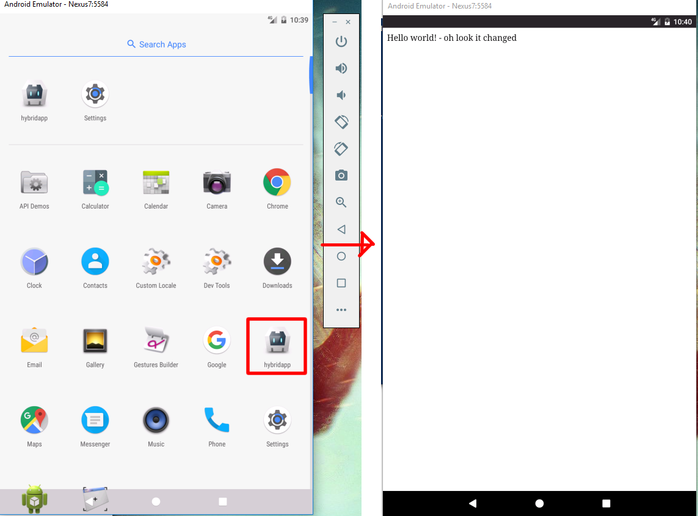
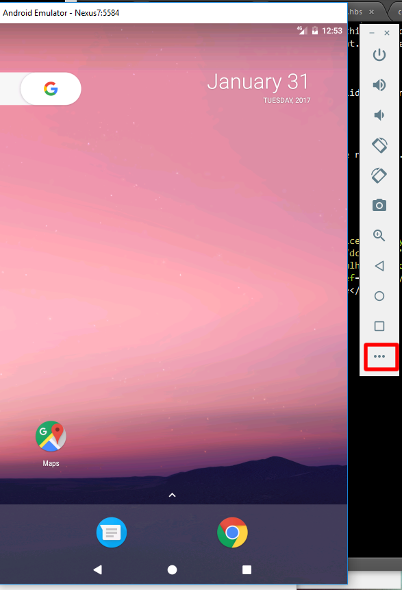
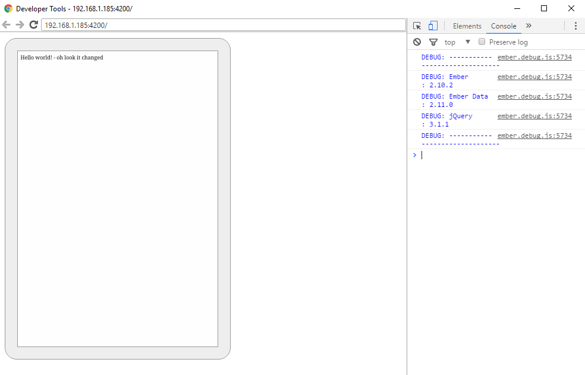
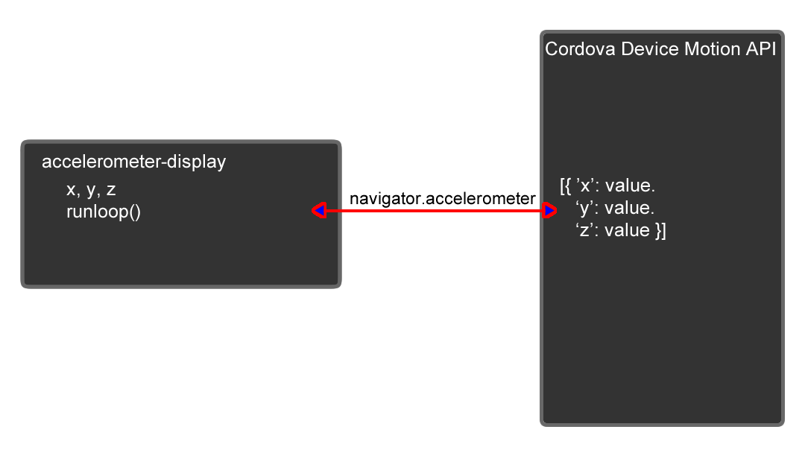

# Building a Hybrid App in Android and Ember

### Table of Contents
[Introduction](#introduction)  
[Getting started](#getting-started)  
[Dev tool usage](#dev-tool-usage)  
[Working with your first Cordova Plugin](#working-with-your-first-cordova-plugin)  
[Accelerometer display component](#accelerometer-display-component)  
[Extending the app](#extending-the-app)  


### Introduction
In this module you will go behind a simple 'Hello World' app and interact with some of the native device features that Cordova gives you access too. It assumes you have completed the basic setup, configuration, and installation of Cordova, Android, and Ember as the [previous tutorial](hybrid-app-tutorial.md) discussed. 

### Getting Started
Start by getting our development environment setup. For this tutorial, we will use the Android emulator we setup last time. If you want, you can replace the emulator portions with your actual Android device and use ADB.

#### Starting the Android Emulator
open a new shell (power shell or CMD if windows), navigate to your code repository, and launch the emulator.

```
cd ./hybridapp/
ember cdv run --platform=android --emulator
```
#### Running the livereload ember cordova server
Once the emulator is launched, you can start serving the live-reload ember server using the following command:

```
ember cdv:serve --platform=android --verbose
```

If all goes well you should see a terminal running ember (leave it running):


and then upon opening the app, the app running in the emulator:



[Top](#table-of-contents)

### Dev tool usage

#### Android Tools
Before we get started lets launch some dev tools. First and foremost, launch the Android emulator controls by clicking the '...' shown below. This will launch a panel of various controls that we can use to simulate GPS, accelerometer, and other types of data.



This will launch a window that should resemble this:


We will use this later to simulate some accelerometer activity.

#### Chrome Dev tools 
This may be surprising to you, but the chrome dev tools we all know and love work with Android! Think about it, your app is really a fancy web app living in a native wrapper. Chrome is smart enough to talk to Android device browsers - so it can talk to Cordova Webviews too!

To inspect our app, open a new chrome window and type the following:
```
chrome://inspect/#devices
```

You should see something like this:


Clicking 'inspect' will give you a full visual + console toolset that you can use to interact directly with the running app.



Pretty neat!

[Top](#table-of-contents)

### Working with your first Cordova Plugin
Lets get started with really using Cordova. The beauty of the platform is that it exposed native libraries to webviews in native wrappers. Let's explore our first plugin. 

#### Adding the plugin
Stop the ember cdv:serve command running in the original shell you opened (ctrl + c), open up a new shell and navigate to your ember project.

```bash
cd ./hybridapp/
```

Now lets tell cordova to add a plugin to our app. In the new terminal type:

```bash
ember cdv:plugin add cordova-plugin-device-motion
```
Once this completes, rebuild your app and send the apk to the emulator.

```bash
ember cdv run --platform=android --emulator
```

Now with the app running in the emulator, switch back to the first terminal and re-run the ember livereload server.
```bash
ember cdv:serve --platform=android --verbose
```

[Top](#table-of-contents)

### Accelerometer display component
Lets create a new component that will be responsible for displaying accelerometer data as it comes in.
```bash
ember generate component accelerometer-display
```

open up and edit the ```/app/templates/application.hbs``` template to look like the following:

> raw code below

```hbs
Demo Cordova Plugins For Days

{{accelerometer-display currX=x currY=y}}

```
Now open the new component ```/app/templates/components/accelerometer-display.hbs``` and modify it to the following:

```hbs
Accelerometer X value: {{x}}<br>
Accelerometer Y value: {{y}}<br>
Accelerometer Z value: {{z}}<br>
```

Saving your code you should see:


#### Making it actually work
Now that we have some basic markup, we need to tell our ember component where to get its data from. This involves connecting the component to the cordova plugin data via the cordova API. Essentially we want our component to work as shown in the following diagram.


> The runloop is a function that will be responsible for invoking the Cordova API and getting and updating the current values of x, y, and z.

To implement this, lets modify our component code in ```/app/components/accelerometer-display.js```

> Raw code below

```js
import Ember from 'ember';

export default Ember.Component.extend({
  x: 0,
  y: 0,
  z: 0,
  on: true,
  startLogging: function(){
    //begin logging accelerometer data once the component launches

    var component = this;
    this.updateAccelData(component)
    
  }.on('init'),
  updateAccelData: function(component){
    Ember.run.later(function(){
      //wrapper to preserve binding satistfaction
      try {
        //invoke cordova accelerometer Plugin and get accelerometer data
        navigator.accelerometer.getCurrentAcceleration(function (acceleration) {//success callback
            console.log('acceleration setvars called');
            component.set('x', acceleration.x);
            component.set('y', acceleration.y);
            component.set('z', acceleration.z);
            console.log("accel vals: x: "+ acceleration.x+ " y: "+acceleration.y+" z: "+acceleration.z+" t: "+ Date.now());
        }, function (error) {//error callback
            console.log('error: ' + error);
        });
      }
      catch(err){
        console.log('error: '+err);
      }
      if(component.get('on')){
        //keep running
        component.updateAccelData(component); //recurse
      }

    }, 100);//run ever 100ms
  }
});
```

There is a lot here, so lets unpack it. First, lines 4-7, setup some basic variables for storing the x, y, and z parameters. The 'on' variable is a boolean that indicates when to stop the run loop. Lines 8-14 initialize the run loop, but waiting until the component has rendered (i.e. 'on init'). The meat of the componet is in lines 15-39. This updateAccelData method runs every 100ms and invokes the navigator.accelerometer method as outlined in the [cordova API](https://cordova.apache.org/docs/en/latest/reference/cordova-plugin-device-motion/index.html#navigatoraccelerometergetcurrentacceleration): (please review this method before proceeding). Sepcifically, the function invokes the accelerometer and then stores x, y, and z back into the component. On lines 33-36, the function will decides to 'loop' again if ```on``` is true. 

#### Testing it out
Once you've saved the new code, try playing around with it using the Android controls. I started by 'sliding down' and turning off rotate display functionality on the emulated phone.


With rotate display off, I opened the Android emulator tools and started rotating the phone to get some readings.


[Top](#table-of-contents)

### Extending the app
Just for kicks, lets extend this app and add a time-series chart from [http://opensource.addepar.com/ember-charts/#/time-series](http://opensource.addepar.com/ember-charts/#/time-series). We can store accelerometer data into an array of previous points and then graph them.

```bash
ember install ember-charts
```

#### Template Code
First open your template code ./app/templates/components/accelerometer-display.hbs
edit it to the following to add our chart component in. 

```hbs
Accelerometer X value: {{x}}<br>
Accelerometer Y value: {{y}}<br>
Accelerometer Z value: {{z}}<br>

{{time-series-chart lineData=accelHistory}}
```
This tells the chart library that our lineData is in a variable called 'accelHistory'. It doesn't exist yet, but we are about to create it.

#### Component Code
Now open your component code ./app/components/accelerometer-display.js and modify it to the following, adding an array of data points and code to update the array as new points come in.

> Raw code below

```js
import Ember from 'ember';

export default Ember.Component.extend({
  x: 0,
  y: 0,
  z: 0,
  accelHistory: [],
  on: true,
  startLogging: function(){
    //begin logging accelerometer data once the component launches

    var component = this;
    this.updateAccelData(component);
    
  }.on('init'),
  updateAccelData: function(component){
    Ember.run.later(function(){
      //wrapper to preserve binding satistfaction
      try {
        //invoke cordova accelerometer Plugin and get accelerometer data
        navigator.accelerometer.getCurrentAcceleration(function (acceleration) {//success callback
            //console.log('acceleration setvars called');
            component.set('x', acceleration.x);
            component.set('y', acceleration.y);
            component.set('z', acceleration.z);

            //update history, maintain 50 points max
            var history=component.get('accelHistory');
            if(history.length === 150){
              history.shiftObject();//shift an x off
              history.shiftObject();//shift a y off
              history.shiftObject();//shift a z off
            }
            var t = Date.now();
            var newXPoint = {time: t, label: 'x', value: acceleration.x};
            var newYPoint = {time: t, label: 'y', value: acceleration.y};
            var newZPoint = {time: t, label: 'z', value: acceleration.z};
            history.addObjects([newXPoint, newYPoint, newZPoint]);
            //console.log("accel vals: x: "+ acceleration.x+ " y: "+acceleration.y+" z: "+acceleration.z+" t: "+ Date.now());
        }, function (error) {//error callback
            console.log('error: ' + error);
        });
      }
      catch(err){
        console.log('error: '+err);
      }
      if(component.get('on')){
        //keep running
        component.updateAccelData(component); //recurse
      }

    }, 100);//run ever 100ms
  }
});

```

Now instead of just overwriting X, Y, and Z when the next point comes in, we are pushing those values into an array of 50 time points. When the array gets full, we shift off the first three points (x, y, z for a single time t) and add on the new ones. Pretty nifty. 

#### Time to test it out
I've added another dandy gif of the graph. Test it out yourself!


[Top](#table-of-contents)

### Integrating other Cordova Plugins
You can apply the same logic used for Accelerometer to other Cordova Plugins. The typical ember-cordova workflow is

1. Install the cordova plugin using ```ember cdv:plugin add <name of plugin>```
1. Create an ember component to handle the data and manage the interaction with the plugin
1. Add the component somewhere in your App's template code
1. Invoke the Cordova API (Typically ```navigator.<name of plugin>```) in your component code according to the documentation and update the component variables tracking the data accordingly.

#### Try it
Work with someone else in the class and add a feature to your app to use another component. Pick from one of the components listed in the [cordova docs](https://cordova.apache.org/docs/en/latest/reference/cordova-plugin-battery-status/index.html)

When you've integrated it, fork this repo and edit hybrid-app-tutorial-part2.md to include your directions (below in this section) and make a pull request to add in your own directions to use other features. This way everyone can benefit!

### Student Contributions
The following plugin module directions are submitted by previous students in the course. 

#### Authors

Olivier Avande

#### Plugin Name (which plugin did you look at?)
Cordova Camera API Plugin 
https://cordova.apache.org/docs/en/latest/reference/cordova-plugin-camera/

#### Usage

Instruction to use this plugin
### 1. Install the cordova plugin
[corber plugin add cordova-plugin-camera]

### 2. Generate Ember component
[ember generate component take-picture]

### 3. Modify the component context and template as follow:
### 3.a .../app/components/take-picture.js
```js
import Component from '@ember/component';

export default Component.extend({

	photo:null,

	init() {
		
		this._super(arguments);
		
	},
	
	 cameraTakePict(){

	 	var componentscope = this;

	 	try{
			navigator.camera.getPicture(
			function(imageData){ 
				//do something if succesfull
				//imageData = 'data:image/jpeg;base64,'+imageData;
				//imageData = imageData.replace(/^file:\/\//, '');
				componentscope.set('photo',imageData);	

			}, function(message){
				//handle error if not
				alert("The operation failed because: "+message);

			},	{quality:50,destinationType:Camera.DestinationType.FILE_URI,correctOrientation:true,targetHeight:500,targetWidth:500}
		)
	 	}catch(err){
	 		console.log('Error: '+err)
	 	}

	},

	actions:{
		takePicture(){
			console.log('In action ')
			this.cameraTakePict();
		}
	}
	
});
```

### 3.b .../app/templates/components/take-picture.hbs

```hbs
<button {{action 'takePicture'}}> Take Picture </button><br>
<div class="capturePhoto">
	
</div>
```

### 3.c ../app/templates/application.hbs
Calls the take-picture component by:

```hbs
{{take-picture}}
```

#### Authors 
Gabi Wethor 

#### Plugin Name (which plugin did you look at?) 
Cordova Plugin Battery Status
https://cordova.apache.org/docs/en/latest/reference/cordova-plugin-battery-status/index.html
#### Usage
Hey guys :) 
#### 1. Install Cordova Plugin 
[ember cdv:plugin add cordova-plugin-battery-status]
#### 2. Generate Ember Component
[ember generate component battery-display]
#### 3. Edit the following files: 
#### 3a. application.hbs 
Calls the battery-display component.
 
 Battery Status
 {{battery-display}} 
  
#### 3b. battery-display.hbs 
Calls the level variable from the battery-display.js file. I included a % because the battery status needs to display as a percentage.
  
 Battery Level: {{lvl}} % <br>
 
#### 3c. battery-display.js 
Declaring our variables and utilizing the navigator to call the current battery status. Then multiplied by 100 to convert to a whole number.
 
 import Ember from 'ember';

export default Ember.Component.extend({
  lvl: 0,
  on: true,
  startLogging: function(){
      var component = this;
      this.onBatteryStatus(component);
  }.on('init'),
  onBatteryStatus: function (component) {
     navigator.getBattery().then(function(battery){
     component.set('lvl', battery.level * 100);
     });
	}
});

#### Author
Jeff Dempsey

#### Plugin Name (which plugin did you look at?)
Device Orientation - https://cordova.apache.org/docs/en/latest/reference/cordova-plugin-device-orientation/index.html
This plugin gives access to the device compass to give a heading in degrees.

#### Usage
1. Install plugin [ember cdv:cordova plugin add cordova-plugin-device-orientation]
1. Write necessary files to process and display data.

2a. /app/templates/application.hbs
> Calls out to orientation-display component to place its template here.
> Code:

```hbs
{{orientation-display currHead=heading}}
```

2b. /app/templates/components/orientation-display.hbs
>Sets up the template within application.hbs and calls the javascript file to fill the {{heading}} value in degrees. Basically copied the format from in-class accelerometer example.
>Code:

```hbs
Orientation Heading: {{heading}}<br>
```

2c. /app/components/orientation-display.js
> Queries Cordova for current device heading, in degrees, every 100ms. Since I'm new to all this, I again largely copied the format of the js file for the accelerometer-display. 

> Code:

```javascript
import Ember from 'ember';

export default Ember.Component.extend({
  heading: null,

  //Begin collecting heading data
  startLogging: function(){
    var component = this;
    this.get('updateHeading')(this);
  }.on('init'),
  updateHeading: function(component){
    Ember.run.later(function(){
      try {
        navigator.compass.getCurrentHeading(function(heading) {//if successful
          component.set('heading', heading.magneticHeading);
          console.log('Compass heading:');
          console.log(heading);
        }, function(error){//if error
          console.log('Compass heading error.');
          console.log(error);
        });
      } catch (error) {
        console.log('Compass heading error.');
        console.log(error);
      }
      component.get('updateHeading')(component);
    }, 100); //run after 100ms, recurses to effectively run every 100ms
  }
});
```

#### Authors 
James Percival

#### Plugin Name (which plugin did you look at?)
cordova-plugin-contacts[https://www.npmjs.com/package/cordova-plugin-contacts]
Interesting plugin that allows the adding, viewing, and searching of contacts.

#### Usage
1. Install the plugin [ember cdv:plugin add cordova-plugin-contacts]
1. Generate the files [ember generate component contacts-display]
1. Edit the neccesary files:

3a. /app/templates/application.hbs

> Calls out to the contacts-display component to place its template here.

> Raw code below

```hbs
  {{contacts-display}}
```
3b. /app/templates/components/contacts-display.hbs

>Sets up its template inside application.hbs and then calls out to the javascript file to fill in {{q}} and {{w}}. Had to use the pre-wrap/pre-line style in order to preserve and display the newlines.

> Raw code below

```hbs
  Total Number of Contacts: {{q}}<br>
  Names:Numbers
  <div style="white-space: pre-wrap;">{{w}}</div>
```
3c. /app/components/contacts-display.js

>Queries Cordova and asks for an array of contact objects. We then list the number that was returned, their name, and finally their phone number. We then update q and w accordingly with the above information. Bad variable names... I know... This was all just messing around with it and once it worked I left it alone.

> Raw code below

```js
  import Ember from 'ember';
  export default Ember.Component.extend({
    q:0,
    w:"",
    startLogging: function(){
        //begin logging accelerometer data once the component launches
        var component = this;
        this.hi2(component);
    }.on('init'),
    hi2: function(component){
      var fields = [navigator.contacts.fieldType.displayName, navigator.contacts.fieldType.name];
      navigator.contacts.find(fields, function(contacts){
        component.set('q',contacts.length);
        var nameToNumStr = "";
        contacts.forEach(function(ele){
          nameToNumStr += ele.name.givenName+':'+
            ele.phoneNumbers[0].value+'\n';
        });
        console.log(nameToNumStr);
        component.set('w', nameToNumStr);
      });
    }
  });
```

#### Authors 
Vaibhav Ingle

#### Plugin Name (which plugin did you look at?)
cordova-plugin-geolocation[https://cordova.apache.org/docs/en/latest/reference/cordova-plugin-geolocation/index.html]
This plugin provides information about the device's location, such as latitude and longitude.
Note: This plugin only works if you serve the app from a secure url. In order to do so you 
will need to setup the ember-cli to serve the index.html from an https domain. The following link guides you through the process of generating your own self signed ssl certificate:
https://devcenter.heroku.com/articles/ssl-certificate-self

#### Usage
1. Install the plugin [ember cdv:plugin add cordova-plugin-geolocation]
2. Generate the files [ember generate component geolocation-display]
3. Edit the neccesary files:

3a. /app/templates/application.hbs

>This calls the geolocation-display component.

> Raw code below

  ```hbs
Cordova Plugin For Geolocation 

{{geolocation-display }}
  ```
3b. /app/templates/components/geolocation-display.hbs

>This template takes values from javascript file and assigns the values to the lat and lng. 

> Raw code below

```hbs
Latitude value: {{lat}}<br>
Longitude value: {{lng}}<br>
```

3c. /app/components/geolocation-display.js

>This javascript Queries Cordova and accepts a Position object, which contains the current GPS coordinates. Then the variables 
lng,lat and alt are updated with the current GPS coordinates.

> Raw code below

```javascript
import Ember from 'ember';

export default Ember.Component.extend({
  lng: 0,
  lat: 0,
  alt: 0,
  
  on: true,
  startLogging: function(){
    //begin logging geolocation data once the component launches

    var component = this;
    this.computeGPS(component);

  }.on('init'),
  computeGPS: function(component){
    Ember.run.later(function(){
      //wrapper to preserve binding satistfaction
      try {
        //invoke cordova geolocation Plugin and get geolocation data
        navigator.geolocation.getCurrentPosition(function (position) {//success callback
            //console.log('acceleration setvars called');
            component.set('lng', position.coords.longitude);
			console.log(position.coords);
            component.set('lat', position.coords.latitude);
            component.set('alt', position.coords.altitude);

           
        }, function (error) {//error callback	
			
            console.log(error);
        });
      }
      catch(err){
        console.log('error: '+err);
      }
      if(component.get('on')){
        //keep running
        component.computeGPS(component); //recurse
      }

    }, 10000);//run ever 10000ms
  }
});
```  

#### Author
Gib Filter

#### Plugin Name (which plugin did you look at?)
Media - https://cordova.apache.org/docs/en/latest/reference/cordova-plugin-media/index.html

This plugin provides the ability to record and play back audio files on a device.

#### Usage
1. Install plugin [ember cdv:cordova plugin add cordova-plugin-media]
2. Create new componenent in ember for our view [ember generate component gif-mash]
3. Update Files

3a. /app/templates/application.hbs
> Call our new component from the main application
> Code:

```hbs
.gif mashup machine!
{{gif-mash}}
```

3b. /app/templates/components/gif-mash.hbs
>Set up the gif-mash home screen
>Code:

```hbs
<br>
URL of .gif: {{input value=gifUrl}}<br>
URL of music: {{input value=musicUrl}}<br>

{{#if isPlaying}}
	<button {{action "stopMus"}}>Stop!</button>
	
{{else}}
	<button {{action "playMus" musicUrl}}>Play!</button>
{{/if}}
```

3c. /app/components/gif-mash.js
> Background stuff for the gif-mash

> Code:

```javascript
import Ember from 'ember';

export default Ember.Component.extend({
	isPlaying: false,
	my_media: null,
	genMash: null,
	loadCode: null,
	musicUrl: "http://www.midiworld.com/download/4726",
	gifUrl: "http://i1090.photobucket.com/albums/i363/scooterr98/Icons/170422_dancing_banana.gif",
	apiUrl: "https://is.gd/create.php?format=simple&url=",
	ajax : function(getIt) {
		return Em.$.ajax({url: getIt});
	},

	actions: {
		playMus : function (musUrl) {

			this.my_media = new Media(musUrl, 
				 // success callback
		        function () {
		            console.log("playAudio():Audio Success");
		        },
		        // error callback
		        function (err) {
		            console.log("playAudio():Audio Error: " + err);
		            console.log(err);
		        });

		   	//play the song
			this.my_media.play();
			//set playing to true, to toggle the view in the template
			this.set('isPlaying', true);
		},
		stopMus : function () {
			//stop music, toggle the is playing
			this.my_media.stop();
			this.my_media.release();
			this.set('isPlaying', false);
		},
	}

});
```

[Top](#table-of-contents)

### Next time we explore vulnerabilities and exploitations in hybrid apps.

#### License
<a rel="license" href="http://creativecommons.org/licenses/by-nc-sa/4.0/"></a><br /><span xmlns:dct="http://purl.org/dc/terms/" property="dct:title">CYBER8480 and related works</span> by <a xmlns:cc="http://creativecommons.org/ns#" href="http://faculty.ist.unomaha.edu/mlhale" property="cc:attributionName" rel="cc:attributionURL">Matt Hale</a> are licensed under a <a rel="license" href="http://creativecommons.org/licenses/by-nc-sa/4.0/">Creative Commons Attribution-NonCommercial-ShareAlike 4.0 International License</a>.
