# Building a Hybrid App in Android and Ember

### Table of Contents
[Introduction](#introduction)  
[Installing Cordova and Ember](#installing-cordova-and-ember)  
[Creating a new Ember project](#creating-a-new-ember-project)  
[Make ember and cordova play nice](#make-ember-and-cordova-play-nice)  
[Adding platforms](#adding-platforms)  
[Building and deploying the app](#building-and-deploying-the-app)  
[Live reloading of phone app](#live-reload)  
[Trying it out](#trying-it-out)

### Introduction

Hybrid apps are what you get when web apps and native apps have a baby. The core limitation of web apps in mobile environments is there inability to access native device features (e.g. photo libraries, keyboard functions, and bluetooth capabilities - to name a few). The core strength of web apps is their ability to be deployed cross-platform. That is, a web app is the same for Android as it is for iOS or Windows phone. This means developers can iterate much quicker without the need to develop stand alone siloed code for different platforms. 

On the flip side, native apps have all of the tight control of mobile operating system and hardware capabilities, but at the cost of being developed in platform specific languages and paradigms. This measn that developers supporting multiple native apps must individually change each code base if they wish to put out an update to their app.

Hybrid apps get the best of both worlds - access to native features, while still being built as a cross-platform web-app. How does this work you ask? Well hybrid apps operate in a native platform-specific 'container.' This native container provides API access to native features to a web app core (where the majority of the app lives). So developers can write one app and just map it to many containers. 

The content of this lesson explores these concepts and helps you build your first cross-platform hybrid app using Apache Cordova and Ember JS.

Our entire setup uses Free and Open Source Software (FOSS). When using FOSS, respect its copyright and license restrictions. These obligations and rights are typically conveyed in a LICENSE file.

[Top](#table-of-contents)

### Installing Cordova and Ember
#### Pre-requisites

##### Git and Npm
This guide assumes you have already installed git (github desktop for windows users) and npm. The guide also assumes both of these packages are available at the command line (or in a power shell). If you do not meet this requirement, see [installing git on mac/windows](https://desktop.github.com/) or (for linux) just:

```
sudo apt-get install git
```

To install node and npm (the node package manager), visit [https://nodejs.org/en/](https://nodejs.org/en/)

##### Android SDK and Java JDK
Cordova (and anything android related) requires the Java Development Kit (JDK) and the Android SDK. To install those follow the guide here: [http://cordova.apache.org/docs/en/latest/guide/platforms/android/index.html#requirements-and-support](http://cordova.apache.org/docs/en/latest/guide/platforms/android/index.html#requirements-and-support)

##### Installing latest Android SDK latest build 
In addition to installing the SDK and Java and configuring your path appropriately, you will also need to use Android Studio to install the latest versions of the Android build files. At the time of writing this tutorial, the latest Android version was Android 7.1 Nougat (API v25).

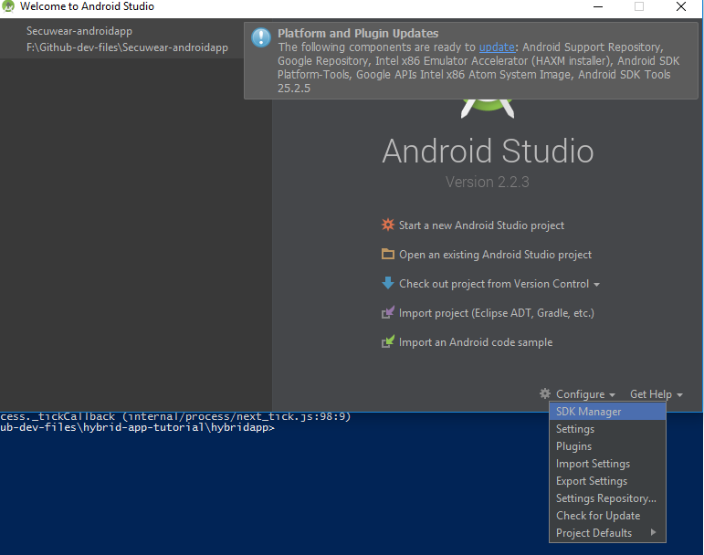
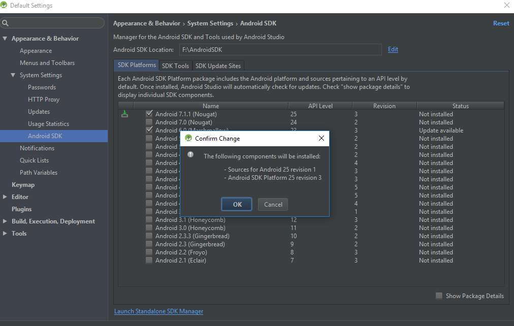
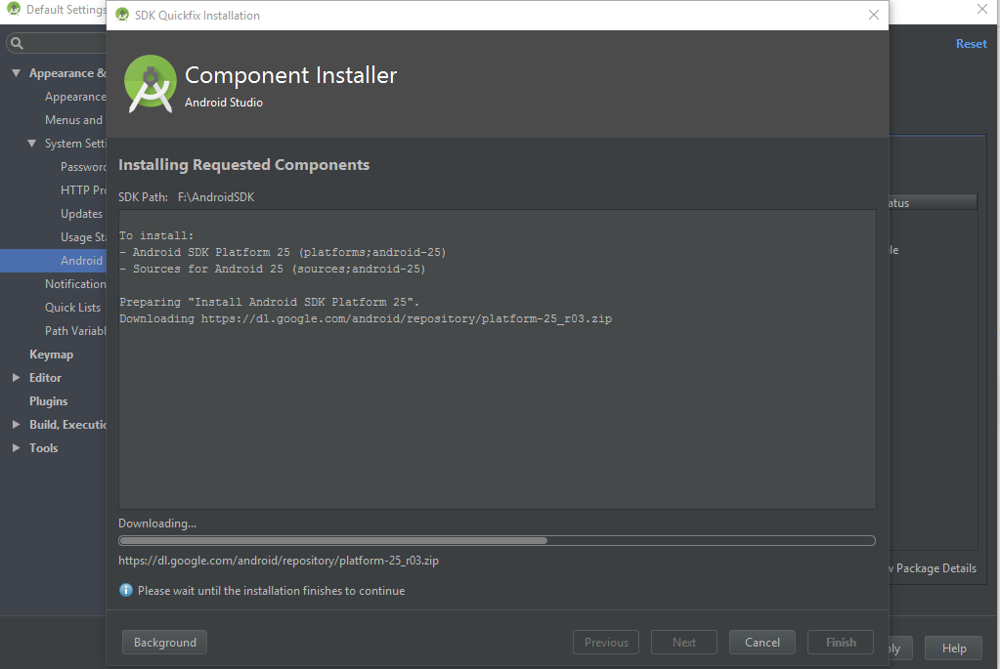

Once these things are installed, you are ready to move on.

#### Installing Cordova

Apache Cordova is a framework that contains a number of native wrappers (containers) that map hardware and operating system features from various vendors (android, ios, etc) to what are called ```webviews```. Webviews are essentially mini-browser windows that re-use the browser capabilities built into mobile operating systems to render HTML, CSS, and Javascript. Cordova allows this view to access approved device features. To get started:

```
npm install -g cordova
```

Cordova supports basically all major mobile platforms and operating systems. See the links below for more information about Cordova.

##### Cordova Architecture

> Image credit http://cordova.apache.org/docs/en/latest/guide/overview/index.html

##### Platform Support

See [https://cordova.apache.org/docs/en/latest/guide/support/index.html](https://cordova.apache.org/docs/en/latest/guide/support/index.html) for a full list of supported platforms and features.

[Top](#table-of-contents)
#### Installing Ember
Since we will be building our app in Ember, lets also install the Ember CLI you worked with before in sec. web dev.

```
npm install -g ember-cli
```

Now you should be able to interact on the command line and see the cordova and ember build tools functioning:

```
cordova help
```

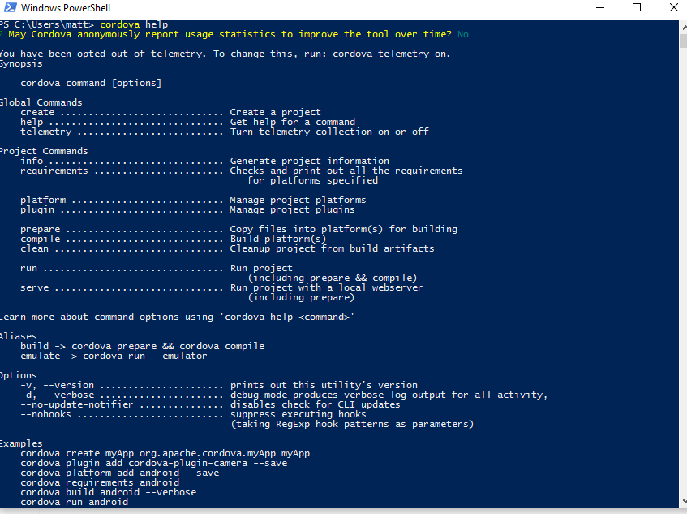
> If you dont see content similar to this, check to ensure your cordova install worked

```
ember help
```

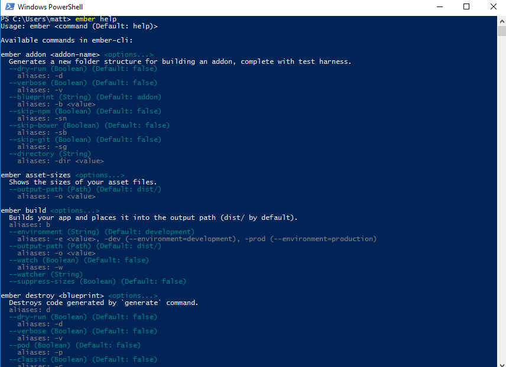
> If you dont see content similar to this, check to ensure your ember install worked.

[Top](#table-of-contents)
### Creating a new ember project

Lets start an empty ember project that we can use to demo the app. We will modify this later (and track its changes on github).
> I suggest you first create a new folder somewhere where you'd like to store the files, then cd into that directory

```
ember new hybridapp
```

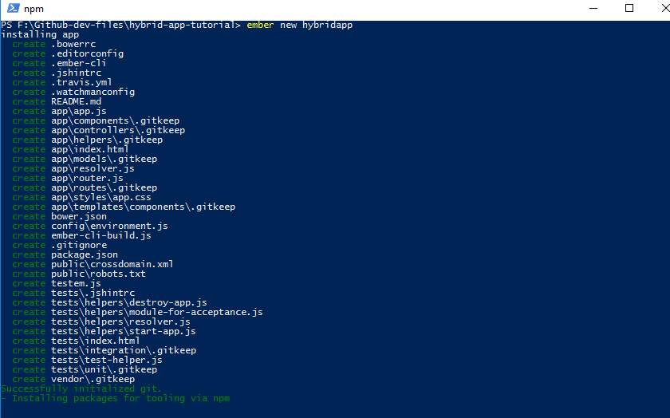
> This may take a few minutes

Create a new repo on github by visiting [https://github.com/new](https://github.com/new). Give it a name, I named mine CYBR-hybrid-app-code so I could share it with all of you. You can call yours simply ```hybridapp``` if you like.

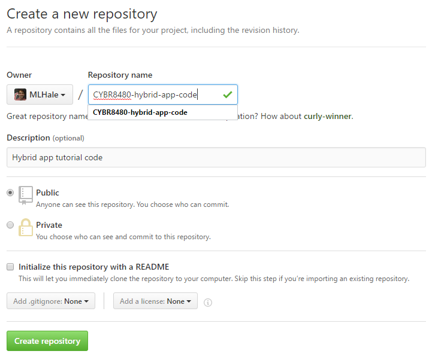

Lets switch back to our shell and commit the code to our new github repo
```
cd hybridapp
git status
git remote add origin <your repo url goes here>
git push -u origin master
```

[Top](#table-of-contents)
### Make ember and cordova play nice
There is a handy ember addon (built by [@poetic](https://github.com/poetic/ember-cli-cordova) and [@isleofcode](https://github.com/isleofcode/ember-cordova)) that makes cordova cli and ember cli seamlessly (and I mean really seamlessly) work together. Lets install it.

```
ember install ember-cordova
```
#### Confirming everything is installed
Before we proceed with building our app, lets double check that all of the prereqs listed earlier are installed properly. Type:

```
ember cordova requirements
```
If you don't see all checks as shown below, you need to go back and installed the prereqs.


### Adding platforms
For this tutorial, lets tell Cordova to build the app for android. In general cordova supports almost all mobile operating systems. For more information see [http://cordova.apache.org/docs/en/latest/platform_plugin_versioning_ref/index.html](http://cordova.apache.org/docs/en/latest/platform_plugin_versioning_ref/index.html)

Using ember cordova, lets add android as a supported platform:

```
ember cdv:platform add android
```

This effectively creates an Android ```Manifest File```- something we will talk about more later in the course. For now, just know that a Manifest file is what tells Android what the app's name is and what it needs access to.

[Top](#table-of-contents)
### Building and Deploying the app
To build the app (produce a .apk file) we just need to tell Ember-cordova to build it for us:

```
ember cdv:build --platform android
```
> You will get an error saying you need to change {{rootURL}}. Essentially, cordova creates a localhost app and runs it using your phone's interal web browser. We just need to change a configuration file in ember to make it happy with this setup.

```
nano config/environment.js
```

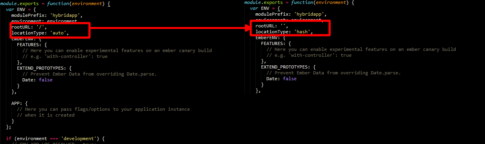

Now rebuild the app:
```
ember cdv:build --platform android
```

> This may take awhile the first time, since Cordova will need to download a bunch of stuff.

You should see a process such as:
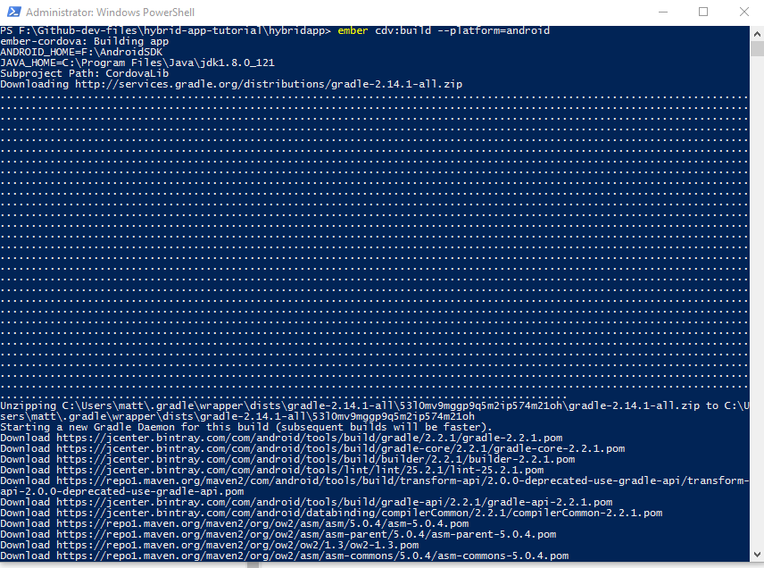

Once done, this should produce a .apk file that you can copy/paste to your phone. If you want to test it out, navigate to the following folder:

```
cd ember-cordova/cordova/platforms/android/build/outputs/apk
ls
```
> You should see a file called something like ```android-x86-debug.apk```

Since this is tedious, the CLI provides us with another command to do it. 
```
ember cdv run --platform=android --emulator
```
> This deploys to a previously configured emulator (you can set this up in android studio). Before you run the command, lets setup an emulator

To make this work, we need to setup an emulator. Open Android studio, select SDK manager, and then launch the standalone SDK manager. Select the 5 packages show below for a variety of emulated hardware.


Once installed, lets setup our emulator image

```
android avd
```


> Wait a few moments for the emulator to load, eventually your app will launch

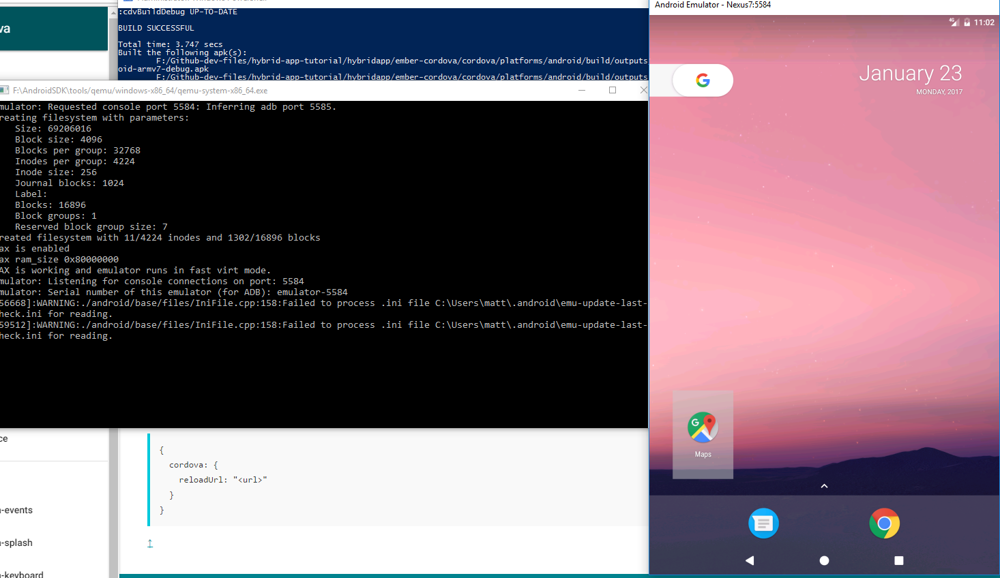

> Tip #1 If you are going to develop on an emulator, it is good to leave the emulator open after the initial launch, it only takes a few seconds to reload an app, but it can take a minute to launch the emulator the first time.
> Tip #2 You can always launch the emulator yourself using ```emulator.exe -avd Nexus7``` on the command line (the nexus7 part would be whatever you called your emulator avd)

To deploy to an Android device, you can instead use:
```
ember cdv run --platform=android --device
```
> note this requires that you have previously installed and configured ADB (the Android Device Bridge) and that your phone is connected to your computer.

#### Live Reload
##### Configuring it
Those familiar with Ember probably are asking themselves - what about the awesome auto-refresh ability? Well ember-cordova supports live reload:

```
ember cdv:serve --platform=android
```

You will get an error (at first):
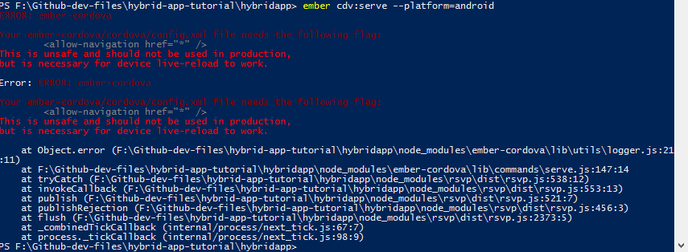

To fix it it, modify ```ember-cordova/cordova/config.xml``` by adding the flag ```<allow-navigation href="*"/>```

> Security Note: This is to be used in development only, you should configure your build environment to allow this, but not your production environment.

Rerunning the command, we see the familiar live-reload ember server, but now with all of the cordova features AND the ability to stream to your phone as a native app. Cool huh?
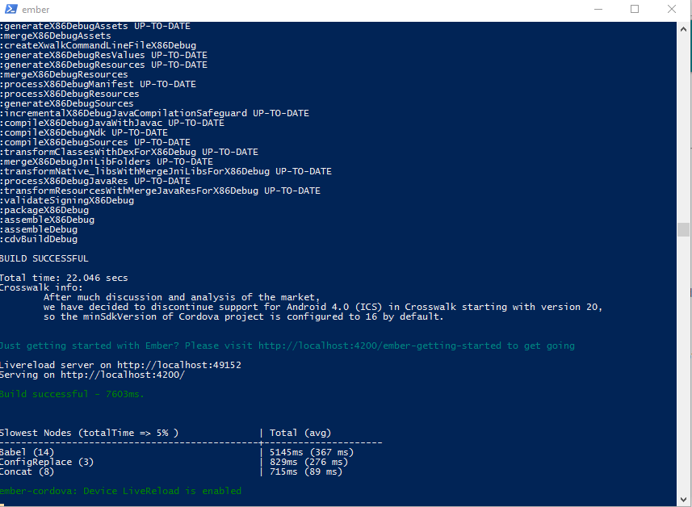

##### Trying it out
Lets try it out. Create a new application template. Then we will deploy the live reload build and then run ember cdv server.

```
ember generate template application
```

Lets just type 'Hello World!' in our new template.

Now rebuild and deploy the app to the emulator

```
ember cdv run --platform=android --emulator
```

> After it has finished building, the app will restart in the emulator and you should see hello world.

Now, run ember cdv server:
```
ember cdv:serve --platform=android --verbose
```


Now modify the application.hbs file in /app/templates to say ```Hello world! - oh look it changed```

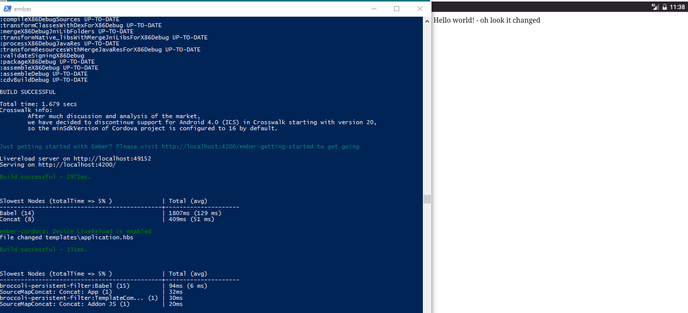

[Top](#table-of-contents)

#### Exploring cordova packages
We will stop here for today and pickup next time with cordova packages that give us access to native features on the device.


#### License
<a rel="license" href="http://creativecommons.org/licenses/by-nc-sa/4.0/"></a><br /><span xmlns:dct="http://purl.org/dc/terms/" property="dct:title">CYBER8480</span> by <a xmlns:cc="http://creativecommons.org/ns#" href="http://faculty.ist.unomaha.edu/mlhale" property="cc:attributionName" rel="cc:attributionURL">Matt Hale</a> work is licensed under a <a rel="license" href="http://creativecommons.org/licenses/by-nc-sa/4.0/">Creative Commons Attribution-NonCommercial-ShareAlike 4.0 International License</a>.
