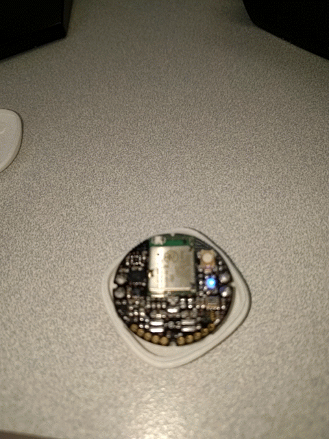
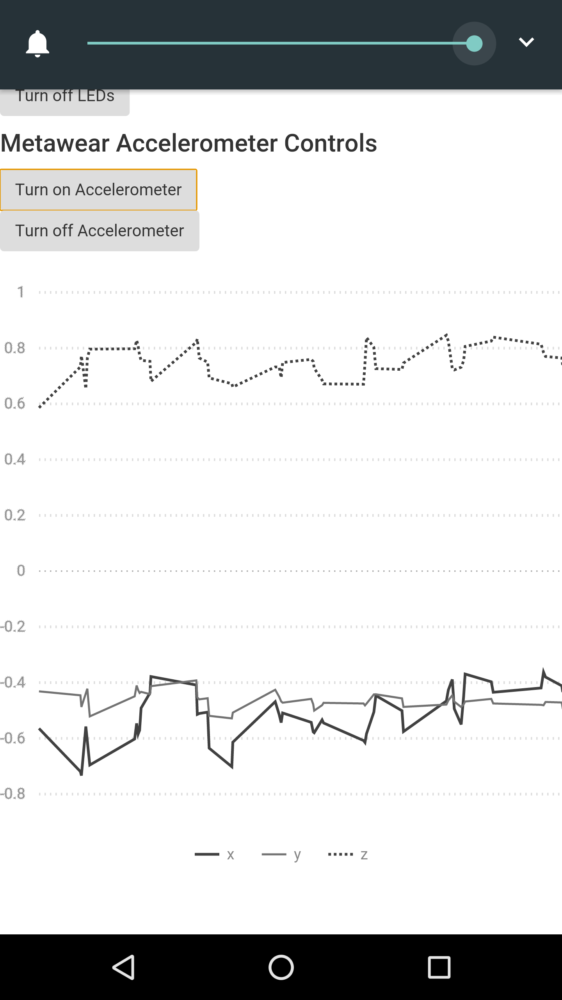

# Building a Hybrid App to talk to Metawear

[Introduction](#introduction)  
[Getting started](#getting-started)  
[Adding support for metawear](#adding-support-for-metawear)  
[Working with accelerometer data](#working-with-accelerometer-data)  
[Extending this app](#extending-this-app)  

## Introduction
This lab will introduce you to the world of Bluetooth LE and allow you to connect to Metawear and turn an LED on or off.

### Getting started
We will start by working on the previous hybrid app you worked on.
Install the cordova plugin for Metawear.

You can read more about this plugin at [https://github.com/mbientlab-projects/MetaWearCordova-Plugin](https://github.com/mbientlab-projects/MetaWearCordova-Plugin).

To install type the following:

```bash
ember cdv:plugin add https://github.com/mbientlab-projects/MetaWearCordova-Plugin
```

Since this plugin requires Android SDK 18+, lets tell cordova to only use 18+.

open ```/ember-cordova/config.xml``` and add the following line:

```bash
<preference name="android-minSdkVersion" value="18" />
```

While we are at it, lets go ahead and install bootstrap, we will use this later to style some buttons for our app.

```bash
ember install ember-bootstrap
```

Now rebuild and redeploy your app and then run ember server

```bash
ember cdv:build --platform android
ember cdv run --platform=android --device
```

Note that the previous command assumes you have ADB installed and your phone or tablet is connected to your machine.

### Adding support for metawear
The basic concept here is that our android cordova app will talk to metwear and invoke some of the hybrid app API functionalities using Bluetooth LE. Our app will be very simple - connect, disconnect, and turn on/off an LED on the device.

To create an interface for this functionality, lets first create a new ember component called ```metawear-control```

at the command line, type: 

```bash
ember generate component metawear-control
```

Now open and modify ```app/application.hbs``` to look like the following, note your file may look different if you created your own feature in previous labs:

```hbs
{{accelerometer-display currX=x currY=y}}

{{metawear-control}}
```

Now lets create a template for the metawear functionality. Open and modify ```app/templates/components/metawear-control.hbs``` to look like the following:

```hbs
<div class="row">
	<div class="col-xs-12">
		<h4>Metawear Device Connection</h4>
		{{#unless metawearConnected}}
			<button type="button" class="btn" {{action 'connect'}}>Connect</button>
		{{else}}
			<button type="button" class="btn red" {{action 'disconnect'}}>Disconnect</button>
		{{/unless}}
	</div>
</div>
{{#if metawearConnected}}
	<div class="row">
		<div class="col-xs-12">
			<h4>Metawear LED Control</h4>
			<button type="button" class="btn red btn-sm" {{action 'playLED'}}>Turn on LED </button><br>
			<button type="button" class="btn red btn-sm" {{action 'stopLED'}}>Turn off LEDs </button>
		</div>
	</div>
{{/if}}
```

Notice that this code has several buttons that allow the app to connect, disconnected, and turn on/off an LED. To make this functionality work, open ```app/components/metawear-control.js``` and modify it to look like the following:

```js
import Ember from 'ember';

export default Ember.Component.extend({
	metawearConnected: false,
	macAddressOfBoard: '',
	actions: {
		connect: function(){
			var component = this;
			Ember.run.later(function(){
				//wrapper to preserve binding satistfaction
				try {
				//invoke metawear connection
					console.log('attempting to connect to: ' + component.get('macAddressOfBoard'));
					metawear.mwdevice.connect(component.get('macAddressOfBoard'),
						function(){//success
							console.log('connected');
							component.set('metawearConnected', true);
						}, function(error){//failure
							console.log('connection failed' +error);
							alert('error: '+error);
						});
				}
				catch(err){
					console.log('error: '+err);
					alert('error: '+err);
				}

			}, 100);//run after 100ms
		},
		disconnect: function(){
			var component = this;
			Ember.run.later(function(){
				//wrapper to preserve binding satistfaction
				try {
				//invoke metawear connection
					console.log('Disconnecting from: ' + component.get('macAddressOfBoard'));
					metawear.mwdevice.disconnect();
					component.set('metawearConnected', false);
				}
				catch(err){
					console.log('error: '+err);
					alert('error: '+err);
				}

			}, 100);//run after 100ms
		},
		playLED: function(){
			var component = this;
			Ember.run.later(function(){
				//wrapper to preserve binding satistfaction
				try {
				//invoke metawear connection
					console.log('Turning on Blue Light: ' + component.get('macAddressOfBoard'));
					metawear.mwdevice.playLED({channel:"BLUE",
						riseTime: 0, pulseDuration: 1000,
						repeatCount: 5, highTime: 500,
						fallTime: 750, lowIntensity: 16,
						highIntensity: 31});
				}
				catch(err){
					console.log('error: '+err);
					alert('error: '+err);
				}

			}, 100);//run after 100ms
		},
		stopLED: function(){
			var component = this;
			Ember.run.later(function(){
				//wrapper to preserve binding satistfaction
				try {
				//invoke metawear connection
					console.log('Shutting off Blue Light: ' + component.get('macAddressOfBoard'));
					metawear.mwdevice.stopLED();
				}
				catch(err){
					console.log('error: '+err);
					alert('error: '+err);
				}

			}, 100);//run after 100ms
		}
	}
});
```

Now Rebuild and redeploy your app:

```bash
ember cdv:build --platform=android
ember cdv run --platform=android --device
```

This code provides 4 actions that the template can use. Each references the ```metawear``` namespace (similar to how previous cordova plugins referenced ```navigator.<plugin-name>```). Each action invokes the relevant function and handles any errors that may occur. If the connection action completes, a flag is set in the component to allow the user to press the light buttons. 

Do note that you will need to set the ```macAddressOfBoard``` variable to be the mac address of your Metawear device.

Test the code by connecting your device to your development machine and deploying to your device.

```bash
ember cdv run --platform=android --device
```

You will need to ensure the Android ADB is working properly for this. For a helpful windows-based how-to, see: [https://www.howtogeek.com/125769/how-to-install-and-use-abd-the-android-debug-bridge-utility/](https://www.howtogeek.com/125769/how-to-install-and-use-abd-the-android-debug-bridge-utility/)

When it is working, clicking the 'LED on' button should cause your metawear to blink a blue light.



### Working with accelerometer data
Below, I show some additional methods for actually starting and stoping the accelerometer and displaying the data you get in an ember-chart like we did before.

In the ```app/components/metawear-control.js``` change the file to the following:

```js
import Ember from 'ember';

export default Ember.Component.extend({
	metawearConnected: false,
	macAddressOfBoard: 'D9:30:6C:DF:E0:A9',
	MWaccelHistory: [],
	updateAccelData: function(component, result){
		component.set('x', result.x);
		component.set('y', result.y);
		component.set('z', result.z);

		//update history, maintain 50 points max
		var history=component.get('MWaccelHistory');
		if(history.length === 150){
			history.shiftObject();//shift an x off
			history.shiftObject();//shift a y off
			history.shiftObject();//shift a z off
		}
		var t = Date.now();
		var newXPoint = {time: t, label: 'x', value: result.x};
		var newYPoint = {time: t, label: 'y', value: result.y};
		var newZPoint = {time: t, label: 'z', value: result.z};
		history.addObjects([newXPoint, newYPoint, newZPoint]);
		console.log('Added point: x=' + result.x + ', y='+result.y+', z='+result.z)
	},
	actions: {
		accelON: function(){
			var component = this;
			Ember.run.later(function(){
				//wrapper to preserve binding satistfaction
				try {
				//invoke metawear connection
					console.log('attempting to start accelerometer on: ' + component.get('macAddressOfBoard'));
					metawear.mwdevice.startAccelerometer(
						function(result){ //success
							component.get('updateAccelData')(component,result);
						}, function(error){//fail
							console.log(error);
							alert('error: '+error);
						}
					);
				}
				catch(err){
					console.log('error: '+err);
					alert('error: '+err);
				}
			}, 100);//run after 100ms
		},
		accelOFF: function(){
			var component = this;
			Ember.run.later(function(){
				//wrapper to preserve binding satistfaction
				try {
				//invoke metawear connection
					console.log('attempting to stop accelerometer on: ' + component.get('macAddressOfBoard'));
					metawear.mwdevice.stopAccelerometer();
				}
				catch(err){
					console.log('error: '+err);
					alert('error: '+err);
				}
			}, 100);//run after 100ms
		},
		connect: function(){
			var component = this;
			Ember.run.later(function(){
				//wrapper to preserve binding satistfaction
				try {
				//invoke metawear connection
					console.log('attempting to connect to: ' + component.get('macAddressOfBoard'));
					metawear.mwdevice.connect(component.get('macAddressOfBoard'),
						function(){//success
							console.log('connected');
							component.set('metawearConnected', true);
						}, function(error){//failure
							console.log('connection failed' +error);
							alert('error: '+error);
						});
				}
				catch(err){
					console.log('error: '+err);
					alert('error: '+err);
				}

			}, 100);//run after 100ms
		},
		disconnect: function(){
			var component = this;
			Ember.run.later(function(){
				//wrapper to preserve binding satistfaction
				try {
				//invoke metawear connection
					console.log('Disconnecting from: ' + component.get('macAddressOfBoard'));
					metawear.mwdevice.disconnect();
					component.set('metawearConnected', false);
				}
				catch(err){
					console.log('error: '+err);
					alert('error: '+err);
				}

			}, 100);//run after 100ms
		},
		playLED: function(){
			var component = this;
			Ember.run.later(function(){
				//wrapper to preserve binding satistfaction
				try {
				//invoke metawear connection
					console.log('Turning on Blue Light: ' + component.get('macAddressOfBoard'));
					metawear.mwdevice.playLED({channel:"BLUE",
						riseTime: 0, pulseDuration: 1000,
						repeatCount: 5, highTime: 500,
						fallTime: 750, lowIntensity: 16,
						highIntensity: 31});
				}
				catch(err){
					console.log('error: '+err);
					alert('error: '+err);
				}

			}, 100);//run after 100ms
		},
		stopLED: function(){
			var component = this;
			Ember.run.later(function(){
				//wrapper to preserve binding satistfaction
				try {
				//invoke metawear connection
					console.log('Shutting off Blue Light: ' + component.get('macAddressOfBoard'));
					metawear.mwdevice.stopLED();
				}
				catch(err){
					console.log('error: '+err);
					alert('error: '+err);
				}

			}, 100);//run after 100ms
		}
	}
});
```

In the template ```app/templates/components/metawear-control.hbs``` modify it to be as follows:

```hbs
<div class="row">
	<div class="col-xs-12">
		<h4>Metawear Device Connection</h4>
		{{#unless metawearConnected}}
			<button type="button" class="btn" {{action 'connect'}}>Connect</button>
		{{else}}
			<button type="button" class="btn red" {{action 'disconnect'}}>Disconnect</button>
		{{/unless}}
	</div>
</div>
{{#if metawearConnected}}
	<div class="row">
		<div class="col-xs-12">
			<h4>Metawear LED Controls</h4>
			<button type="button" class="btn red btn-sm" {{action 'playLED'}}>Turn on LED </button><br>
			<button type="button" class="btn red btn-sm" {{action 'stopLED'}}>Turn off LEDs </button>
		</div>
	</div>

	<div class="row">
		<div class="col-xs-12">
			<h4>Metawear Accelerometer Controls</h4>
			<button type="button" class="btn red btn-sm" {{action 'accelON'}}>Turn on Accelerometer </button><br>
			<button type="button" class="btn red btn-sm" {{action 'accelOFF'}}>Turn off Accelerometer </button>
		</div>
	</div>

	{{time-series-chart lineData=MWaccelHistory}}
{{/if}}
```

This should allow the app to listen for the 'success' callback received by the metawear accelerometer functionality. When the handler receives data and fires off the event, the event calls 'updateAccel' passing it the result and the component reference. This function, logs the data to the history variable, similar to how we logged data before in Lab 2.

When you have it working, test it out by pressing the accelerometer on button. You should see:


### Extending this app
Feel free to play with and customize the app to serve some of the capabilities that Metawear provides in their hybrid app API. Visit [https://github.com/mbientlab-projects/MetaWearCordova-Plugin](https://github.com/mbientlab-projects/MetaWearCordova-Plugin) for more information. Do note that code referring to ```mbientlab``` should really refer to ```metawear```. This was a namespace change awhile back and their documentation isn't the best

#### License
<a rel="license" href="http://creativecommons.org/licenses/by-nc-sa/4.0/"></a><br /><span xmlns:dct="http://purl.org/dc/terms/" property="dct:title">CYBER8480 and related works</span> by <a xmlns:cc="http://creativecommons.org/ns#" href="http://faculty.ist.unomaha.edu/mlhale" property="cc:attributionName" rel="cc:attributionURL">Matt Hale</a> are licensed under a <a rel="license" href="http://creativecommons.org/licenses/by-nc-sa/4.0/">Creative Commons Attribution-NonCommercial-ShareAlike 4.0 International License</a>.

